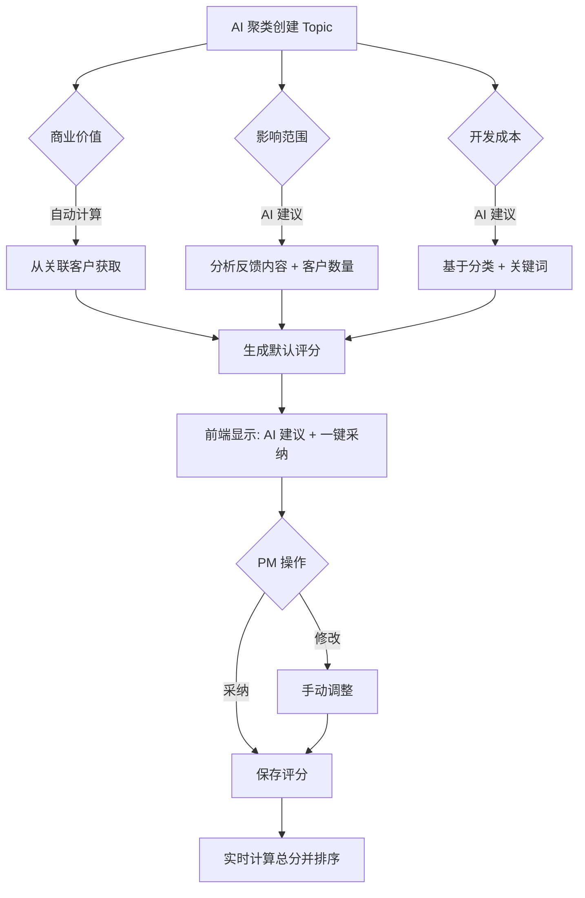

# 优先级评分引擎实现方案

## 核心设计哲学

> "好代码没有特殊情况" - Linus Torvalds

这个需求的本质：**让 AI 降低认知负担,让人工保留决策权**

### 数据流设计



---

## 一、数据结构 (Data First)

### 1. 数据库表（已存在，无需修改）

[`server/backend/app/userecho/model/priority_score.py`](server/backend/app/userecho/model/priority_score.py)

```python
class PriorityScore:
    impact_scope: int       # 1/3/5/10 (个别/部分/大多数/全部)
    business_value: int     # 1-10 (自动计算)
    dev_cost: int          # 1/3/5/10 (1天/3天/5天/10天+)
    urgency_factor: float  # 1.0-2.0 (is_urgent=True 时为 1.5)
    total_score: float     # (影响 × 价值) / 成本 × 紧急系数
```

**关键决策：**

- ✅ 表结构已经正确，不需要改动
- ✅ `topic_id` 外键关联，1:1 关系
- ✅ `business_value` 可手动微调（auto_editable 模式）

---

## 二、核心算法实现

### 1. 商业价值自动计算（后端）

**文件：** `server/backend/app/userecho/service/priority_service.py` (新建)

```python
async def calculate_business_value(
    db: AsyncSession,
    topic_id: str,
    tenant_id: str,
    allow_override: int | None = None
) -> int:
    """
    自动计算商业价值
    
    规则：
 1. 获取 Topic 关联的所有客户
 2. 取最高客户等级的权重
 3. 多客户加成 (+1)
 4. 大客户加成 (+2)
 5. 支持手动微调（allow_override）
    """
    if allow_override is not None:
        return min(10, max(1, allow_override))
    
    # 从 Topic 关联的 Feedback 获取所有客户
    customers = await get_related_customers(db, topic_id, tenant_id)
    
    if not customers:
        return 1  # 匿名反馈默认最低价值
    
    # 客户类型映射
    type_scores = {'normal': 1, 'paid': 3, 'major': 5, 'strategic': 10}
    max_score = max(type_scores[c.customer_type] for c in customers)
    
    # 多客户加成
    unique_customers = set(c.id for c in customers)
    if len(unique_customers) >= 3:
        max_score += 1
    
    # 大客户加成
    if any(c.customer_type in ['major', 'strategic'] for c in customers):
        max_score += 2
    
    return min(10, max_score)
```

---

### 2. 影响范围 AI 分析（后端）

**文件：** `server/backend/utils/ai_client.py` (扩展现有)

```python
async def suggest_impact_scope(
    feedbacks: list[str],
    customer_count: int,
    title: str,
    category: str
) -> dict:
    """
    AI 分析影响范围
    
    返回: {
        "scope": 1/3/5/10,
        "confidence": 0.0-1.0,
        "reason": "检测到 8 个客户反馈"
    }
    """
    # 关键词匹配（快速降级方案）
    keywords = {
        '所有用户': 10, '所有人': 10, '每个人': 10,
        '大部分': 5, '很多人': 5,
        '部分': 3, '个别': 1
    }
    
    # 基于规则的初步判断
    if customer_count >= 10:
        default_scope = 10
    elif customer_count >= 5:
        default_scope = 5
    elif customer_count >= 2:
        default_scope = 3
    else:
        default_scope = 1
    
    # AI 增强分析（可选，成本高）
    if customer_count >= 5:  # 只对重要需求调用 AI
        prompt = f"""分析用户反馈的影响范围：

标题：{title}
分类：{category}
反馈数量：{len(feedbacks)} 条
涉及客户：{customer_count} 个

反馈样本：
{'\n'.join(feedbacks[:5])}

判断影响范围（返回 JSON）：
- 1：个别用户 (1-2个)
- 3：部分用户 (3-10个)
- 5：大多数用户 (10+个)
- 10：全部用户 (核心功能崩溃)

{{"scope": 1/3/5/10, "confidence": 0.8, "reason": "原因"}}"""
        
        try:
            result = await self.chat(prompt)
            return parse_json_response(result)
        except Exception as e:
            log.warning(f'AI analysis failed, using default: {e}')
    
    return {
        'scope': default_scope,
        'confidence': 0.6,
        'reason': f'基于 {customer_count} 个客户反馈的经验规则'
    }
```

---

### 3. 开发成本 AI 建议（后端）

```python
async def suggest_dev_cost(
    title: str,
    category: str,
    feedbacks: list[str]
) -> dict:
    """
    AI 建议开发成本
    
    返回: {
        "days": 1/3/5/10,
        "confidence": 0.5,
        "reason": "基于分类的经验值"
    }
    """
    # 分类默认成本
    category_costs = {
        'bug': 1,
        'improvement': 1,
        'feature': 5,
        'performance': 3,
        'other': 3
    }
    
    default_cost = category_costs.get(category, 3)
    
    # 关键词加权
    if '崩溃' in title or '闪退' in title:
        return {'days': 1, 'confidence': 0.7, 'reason': '紧急 Bug，优先修复'}
    
    if '新增' in title or '增加' in title:
        return {'days': 5, 'confidence': 0.6, 'reason': '新功能开发通常需要 5 天'}
    
    return {
        'days': default_cost,
        'confidence': 0.5,
        'reason': f'基于分类 {category} 的经验值'
    }
```

---

## 三、后端 API 实现

### 1. 聚类时自动生成建议评分

**文件：** [`server/backend/app/userecho/service/clustering_service.py`](server/backend/app/userecho/service/clustering_service.py) (修改)

```python
# 在创建 Topic 后，立即生成 AI 建议评分
async def _create_topic_with_priority_suggestion(
    db: AsyncSession,
    tenant_id: str,
    cluster_feedbacks: list[Feedback],
    topic_data: dict
) -> Topic:
    # 1. 创建 Topic (现有逻辑)
    topic = await crud_topic.create(...)
    
    # 2. 生成 AI 建议评分（混合模式：聚类时简单建议）
    customers = [f.customer_id for f in cluster_feedbacks if f.customer_id]
    customer_count = len(set(customers))
    
    # 商业价值：自动计算
    business_value = await priority_service.calculate_business_value(
        db, topic.id, tenant_id
    )
    
    # 影响范围：快速规则判断（不调用 AI，节省成本）
    if customer_count >= 10:
        impact_scope = 10
    elif customer_count >= 5:
        impact_scope = 5
    elif customer_count >= 2:
        impact_scope = 3
    else:
        impact_scope = 1
    
    # 开发成本：基于分类
    dev_cost_map = {'bug': 1, 'improvement': 1, 'feature': 5, 'performance': 3}
    dev_cost = dev_cost_map.get(topic.category, 3)
    
    # 3. 创建默认评分
    await priority_service.create_or_update(
        db=db,
        tenant_id=tenant_id,
        topic_id=topic.id,
        impact_scope=impact_scope,
        business_value=business_value,
        dev_cost=dev_cost,
        ai_suggested=True  # 标记为 AI 建议
    )
    
    return topic
```

---

### 2. 详情页 AI 重新分析接口

**文件：** `server/backend/app/userecho/api/v1/priority.py` (新建)

```python
@router.post('/topics/{topic_id}/priority/analyze', summary='AI 分析优先级')
async def analyze_priority(
    topic_id: str,
    db: CurrentSession,
    tenant_id: str = CurrentTenantId,
):
    """
    PM 点击「AI 辅助评分」时调用
    触发完整的 AI 分析（包含 LLM 调用）
    """
    topic = await crud_topic.get_by_id(db, topic_id, tenant_id)
    if not topic:
        return response_base.fail(msg='Topic 不存在')
    
    feedbacks = await crud_feedback.get_by_topic(db, topic_id, tenant_id)
    customers = await get_related_customers(db, topic_id, tenant_id)
    
    # AI 完整分析
    impact = await ai_client.suggest_impact_scope(
        feedbacks=[f.content for f in feedbacks],
        customer_count=len(customers),
        title=topic.title,
        category=topic.category
    )
    
    dev_cost = await ai_client.suggest_dev_cost(
        title=topic.title,
        category=topic.category,
        feedbacks=[f.content for f in feedbacks[:5]]
    )
    
    business_value = await priority_service.calculate_business_value(
        db, topic_id, tenant_id
    )
    
    return response_base.success(data={
        'impact_scope': impact,
        'business_value': {
            'value': business_value,
            'confidence': 1.0,
            'reason': '基于客户等级自动计算'
        },
        'dev_cost': dev_cost
    })
```

---

### 3. 保存/更新评分接口

**文件：** `server/backend/app/userecho/api/v1/priority.py`

```python
@router.post('/topics/{topic_id}/priority', summary='创建或更新优先级评分')
async def create_or_update_priority(
    topic_id: str,
    data: PriorityScoreCreate,
    db: CurrentSession,
    tenant_id: str = CurrentTenantId,
):
    """
    PM 确认评分后保存
    """
    # 计算总分
    urgency_factor = 1.5 if data.is_urgent else 1.0
    total_score = (data.impact_scope * data.business_value) / data.dev_cost * urgency_factor
    
    await priority_service.create_or_update(
        db=db,
        tenant_id=tenant_id,
        topic_id=topic_id,
        impact_scope=data.impact_scope,
        business_value=data.business_value,
        dev_cost=data.dev_cost,
        urgency_factor=urgency_factor,
        total_score=total_score
    )
    
    return response_base.success(msg='评分已保存')
```

---

## 四、前端交互实现

### 1. 列表页：行内快速评分入口

**文件：** [`front/apps/web-antd/src/views/userecho/topic/list.vue`](front/apps/web-antd/src/views/userecho/topic/list.vue) (修改)

```vue
<template #priority_score="{ row }">
  <div class="priority-score-cell">
    <a-badge v-if="row.priority_score" 
      :count="row.priority_score.total_score.toFixed(1)" 
      :number-style="{ backgroundColor: getPriorityColor(row.priority_score.total_score) }"
    />
    <a-button v-else 
      type="link" 
      size="small" 
      @click="openQuickScore(row)"
    >
      <span class="iconify lucide--sparkles" /> 快速评分
    </a-button>
  </div>
</template>
```

**新增列：优先级评分**

```typescript
// data.ts
{
  field: 'priority_score',
  title: '优先级',
  width: 120,
  sortable: true,
  slots: { default: 'priority_score' }
}
```

---

### 2. 详情页：完整评分卡片

**文件：** [`front/apps/web-antd/src/views/userecho/topic/detail.vue`](front/apps/web-antd/src/views/userecho/topic/detail.vue) (修改)

```vue
<a-card title="优先级评分" class="mb-4">
  <!-- 已有评分：显示当前值 + 编辑按钮 -->
  <div v-if="priorityScore" class="score-display">
    <a-statistic title="总分" :value="priorityScore.total_score" :precision="1" />
    <a-descriptions :column="3">
      <a-descriptions-item label="影响范围">{{ priorityScore.impact_scope }}</a-descriptions-item>
      <a-descriptions-item label="商业价值">{{ priorityScore.business_value }}</a-descriptions-item>
      <a-descriptions-item label="开发成本">{{ priorityScore.dev_cost }} 天</a-descriptions-item>
    </a-descriptions>
    <a-button @click="showScoreForm = true">
      <EditOutlined /> 修改评分
    </a-button>
  </div>

  <!-- 未评分：显示 AI 建议 + 一键采纳 -->
  <div v-else class="score-suggestion">
    <a-alert 
      type="info" 
      message="AI 已生成默认评分建议" 
      show-icon 
      class="mb-4"
    />
    
    <a-space direction="vertical" :size="16" style="width: 100%">
      <!-- 商业价值：自动计算 -->
      <div class="score-item">
        <span class="label">商业价值：</span>
        <a-rate :value="aiSuggestion.business_value.value" disabled count="10" />
        <a-tag color="green">{{ aiSuggestion.business_value.value }} 分</a-tag>
        <span class="reason">{{ aiSuggestion.business_value.reason }}</span>
        <a-button size="small" type="link" @click="openBusinessValueEdit">微调</a-button>
      </div>

      <!-- 影响范围：AI 建议 + 可修改 -->
      <div class="score-item">
        <span class="label">影响范围：</span>
        <a-select v-model:value="scoreForm.impact_scope" style="width: 150px">
          <a-select-option :value="1">个别用户 (1分)</a-select-option>
          <a-select-option :value="3">部分用户 (3分)</a-select-option>
          <a-select-option :value="5">大多数用户 (5分)</a-select-option>
          <a-select-option :value="10">全部用户 (10分)</a-select-option>
        </a-select>
        <a-tag color="blue">置信度: {{ (aiSuggestion.impact_scope.confidence * 100).toFixed(0) }}%</a-tag>
        <span class="reason">{{ aiSuggestion.impact_scope.reason }}</span>
      </div>

      <!-- 开发成本：AI 建议 + 可修改 -->
      <div class="score-item">
        <span class="label">开发成本：</span>
        <a-select v-model:value="scoreForm.dev_cost" style="width: 150px">
          <a-select-option :value="1">1天</a-select-option>
          <a-select-option :value="3">3天</a-select-option>
          <a-select-option :value="5">5天</a-select-option>
          <a-select-option :value="10">10天+</a-select-option>
        </a-select>
        <a-tag color="orange">置信度: {{ (aiSuggestion.dev_cost.confidence * 100).toFixed(0) }}%</a-tag>
        <span class="reason">{{ aiSuggestion.dev_cost.reason }}</span>
      </div>

      <!-- 实时计算总分 -->
      <a-statistic 
        title="预计总分" 
        :value="calculatedScore" 
        :precision="1" 
        class="mt-4"
      />
    </a-space>

    <div class="actions">
      <a-button type="primary" @click="saveScore">
        <CheckCircleOutlined /> 采纳并保存
      </a-button>
      <a-button @click="reAnalyze">
        <span class="iconify lucide--sparkles" /> AI 重新分析
      </a-button>
    </div>
  </div>
</a-card>
```

---

### 3. 弹窗快速评分（列表页调用）

```vue
<a-modal v-model:open="quickScoreVisible" title="快速评分" @ok="saveQuickScore">
  <a-form :model="scoreForm">
    <a-form-item label="影响范围">
      <a-radio-group v-model:value="scoreForm.impact_scope">
        <a-radio :value="1">个别</a-radio>
        <a-radio :value="3">部分</a-radio>
        <a-radio :value="5">大多数</a-radio>
        <a-radio :value="10">全部</a-radio>
      </a-radio-group>
    </a-form-item>
    <a-form-item label="开发成本">
      <a-radio-group v-model:value="scoreForm.dev_cost">
        <a-radio :value="1">1天</a-radio>
        <a-radio :value="3">3天</a-radio>
        <a-radio :value="5">5天</a-radio>
        <a-radio :value="10">10天+</a-radio>
      </a-radio-group>
    </a-form-item>
    <a-form-item label="商业价值">
      <a-slider v-model:value="scoreForm.business_value" :min="1" :max="10" :marks="{ 1: '低', 10: '高' }" />
    </a-form-item>
    <a-alert type="info" :message="`预计总分：${calculatedScore.toFixed(1)}`" />
  </a-form>
</a-modal>
```

---

## 五、实现顺序

按 Linus 的原则：**先数据流,再边界情况,最后优化**

### 阶段 1：核心功能（2 天）

1. **后端基础**

                                                                                                                                                                                                                                                                                                                                                                                                                                                                                                                                                                                                                                                                                                                                                                                                - `priority_service.py`：商业价值计算
                                                                                                                                                                                                                                                                                                                                                                                                                                                                                                                                                                                                                                                                                                                                                                                                - `ai_client.py`：影响范围 + 开发成本建议（规则 + AI）
                                                                                                                                                                                                                                                                                                                                                                                                                                                                                                                                                                                                                                                                                                                                                                                                - `priority.py` API：分析、保存接口

2. **聚类集成**

                                                                                                                                                                                                                                                                                                                                                                                                                                                                                                                                                                                                                                                                                                                                                                                                - 修改 `clustering_service.py`：聚类时生成默认评分

3. **前端详情页**

                                                                                                                                                                                                                                                                                                                                                                                                                                                                                                                                                                                                                                                                                                                                                                                                - 详情页显示 AI 建议
                                                                                                                                                                                                                                                                                                                                                                                                                                                                                                                                                                                                                                                                                                                                                                                                - 一键采纳 + 手动调整
                                                                                                                                                                                                                                                                                                                                                                                                                                                                                                                                                                                                                                                                                                                                                                                                - 实时计算总分

### 阶段 2：列表页增强（1 天）

4. **列表页集成**

                                                                                                                                                                                                                                                                                                                                                                                                                                                                                                                                                                                                                                                                                                                                                                                                - 新增优先级列
                                                                                                                                                                                                                                                                                                                                                                                                                                                                                                                                                                                                                                                                                                                                                                                                - 行内快速评分入口
                                                                                                                                                                                                                                                                                                                                                                                                                                                                                                                                                                                                                                                                                                                                                                                                - 按优先级排序

5. **弹窗快速评分**

                                                                                                                                                                                                                                                                                                                                                                                                                                                                                                                                                                                                                                                                                                                                                                                                - 简化表单（只有 3 个维度）
                                                                                                                                                                                                                                                                                                                                                                                                                                                                                                                                                                                                                                                                                                                                                                                                - 保存后刷新列表

### 阶段 3：优化与边界情况（0.5 天）

6. **边界处理**

                                                                                                                                                                                                                                                                                                                                                                                                                                                                                                                                                                                                                                                                                                                                                                                                - 未关联客户的 Topic：商业价值默认 1 分 + 警告提示
                                                                                                                                                                                                                                                                                                                                                                                                                                                                                                                                                                                                                                                                                                                                                                                                - AI 调用失败：降级到规则判断
                                                                                                                                                                                                                                                                                                                                                                                                                                                                                                                                                                                                                                                                                                                                                                                                - 评分冲突：防止并发更新

7. **体验优化**

                                                                                                                                                                                                                                                                                                                                                                                                                                                                                                                                                                                                                                                                                                                                                                                                - 加载状态
                                                                                                                                                                                                                                                                                                                                                                                                                                                                                                                                                                                                                                                                                                                                                                                                - 置信度可视化（颜色区分）
                                                                                                                                                                                                                                                                                                                                                                                                                                                                                                                                                                                                                                                                                                                                                                                                - 保存成功提示

---

## 六、关键决策记录

| 决策点 | 选择 | 理由 |

|--------|------|------|

| **商业价值** | 自动计算 + 可微调 | 客观数据已有，降低认知负担 |

| **评分要求** | 自动默认值 | 降低使用门槛，AI 建议作为兜底 |

| **AI 调用时机** | 混合模式 | 聚类时简单规则，详情页完整分析 |

| **UI 位置** | 列表 + 详情都支持 | 灵活性最大化，满足不同场景 |

---

## 七、测试验证

### 功能测试

- [ ] 聚类后自动生成默认评分
- [ ] 详情页显示 AI 建议
- [ ] 商业价值自动计算正确（不同客户等级）
- [ ] 影响范围 AI 分析准确率 ≥ 70%
- [ ] 开发成本建议合理性
- [ ] 列表页按优先级排序正确
- [ ] 快速评分保存成功

### 边界测试

- [ ] 未关联客户的 Topic 处理
- [ ] AI 调用失败降级
- [ ] 并发评分不冲突
- [ ] 手动微调商业价值生效

---

## 八、后续优化方向（V1.1）

- 评分历史记录（谁修改了评分）
- 批量评分功能
- 优先级建议 Prompt 优化（持续迭代）
- 评分准确度追踪（PM 反馈）
