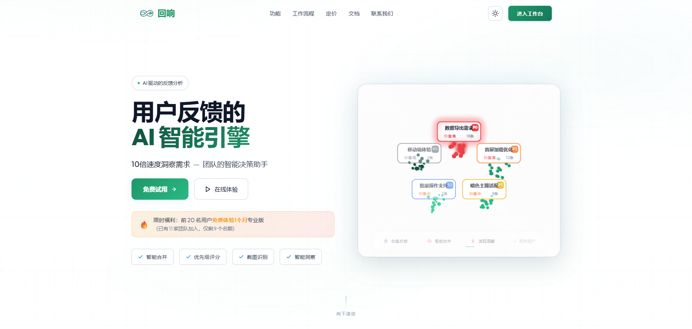
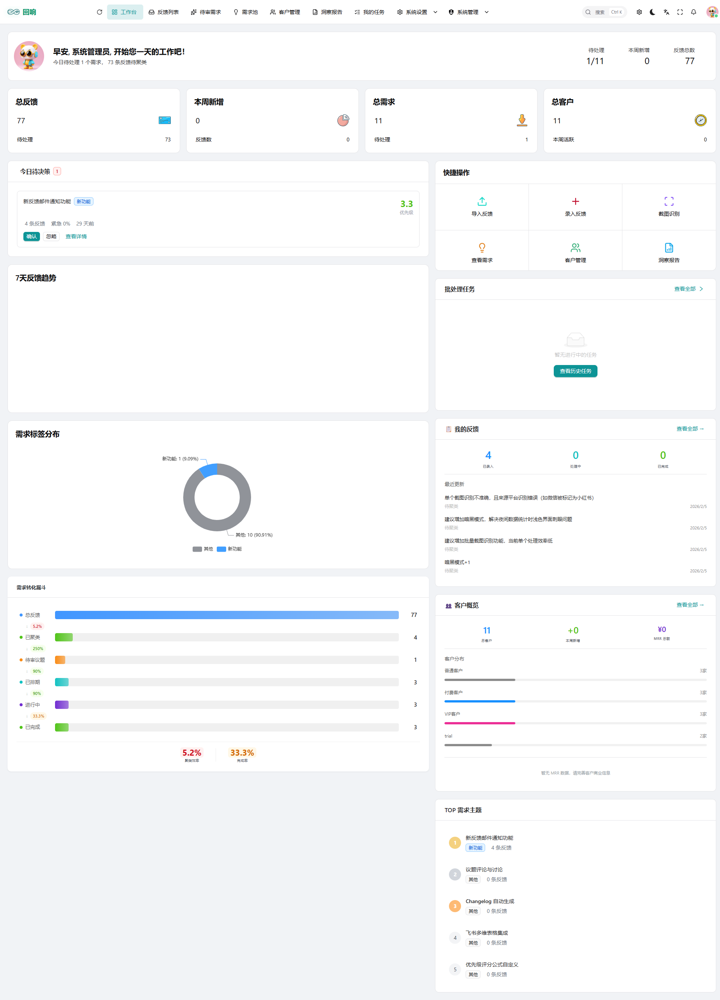
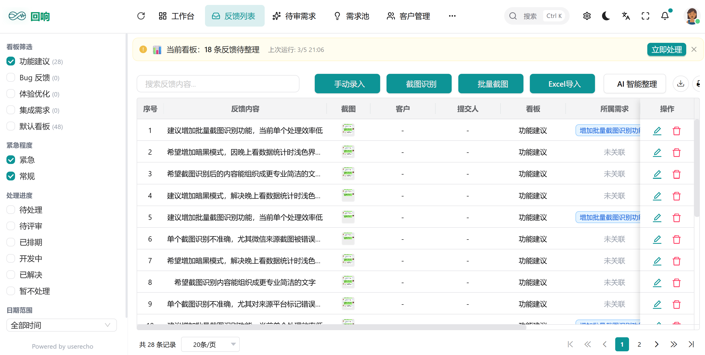
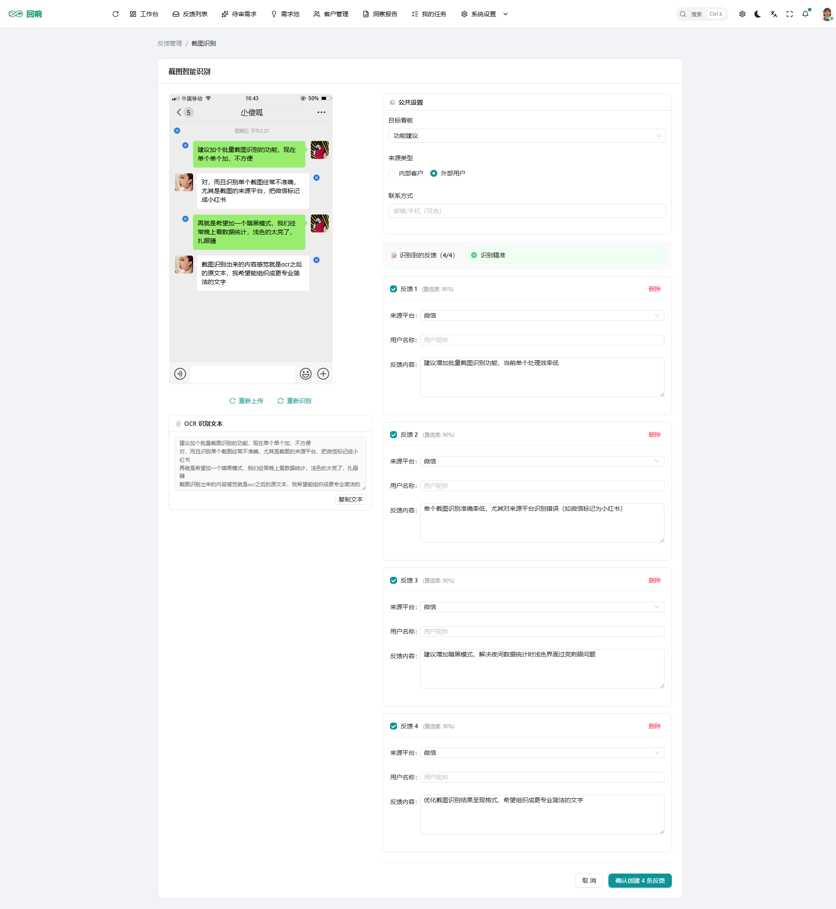
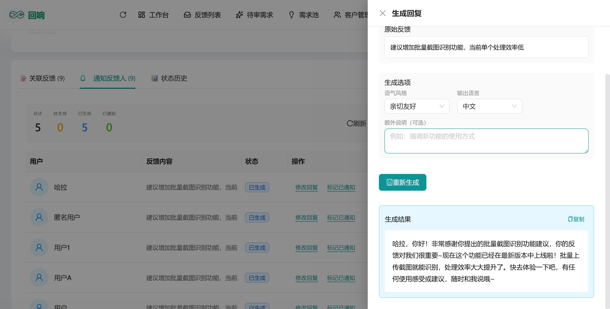
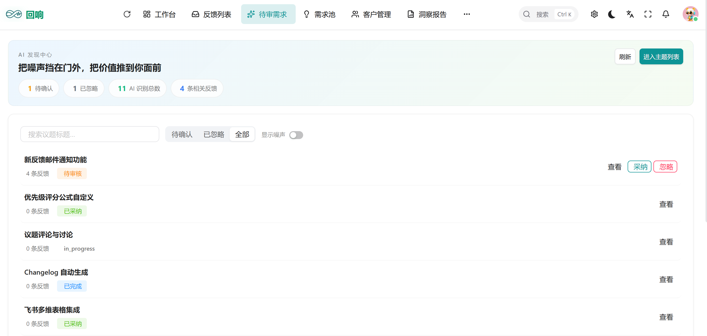
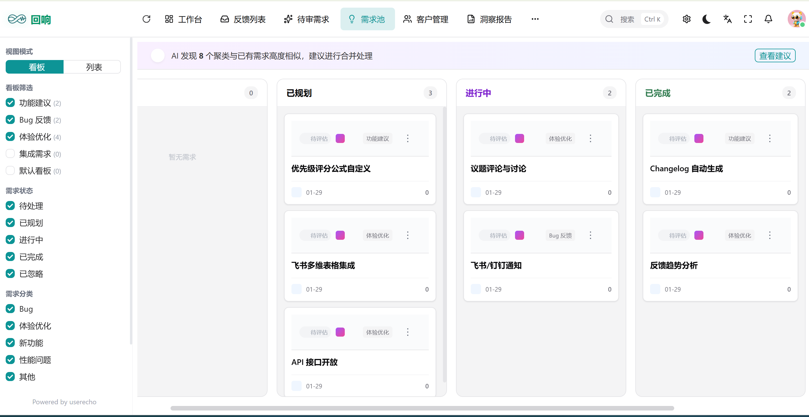
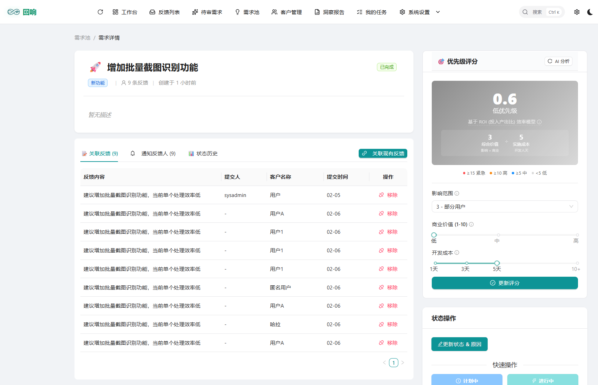
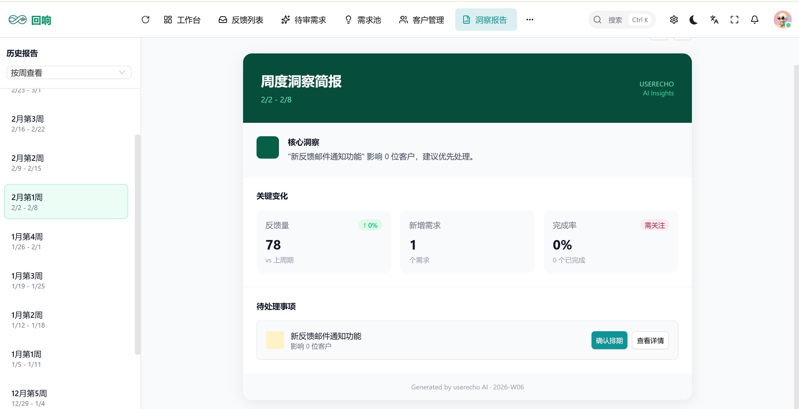

<div align="center">

<h1>userecho</h1>

<p>开源的用户反馈管理与洞察平台 · An Open-Source User Feedback Analytics Platform</p>

🌐 **[正式网站](https://userecho.app/)** &nbsp;|&nbsp; 🎮 **[在线 Demo](https://demo.userecho.app/demo)**

[](./LICENSE)
[](https://www.python.org/downloads/)
[](https://fastapi.tiangolo.com)
[](https://vuejs.org)
[](https://www.postgresql.org)
[](./docker-compose.dokploy.yml)

[English](#english) | [中文](#中文)

</div>

---

## 中文

### 简介

**userecho** 是一个开源的用户反馈收集与分析平台，帮助产品团队。

> 🎮 **想先看看效果？** 访问 [demo.userecho.app/demo](https://demo.userecho.app/demo) 体验在线 Demo（无需注册）。

核心功能：

- ✨ **智能合并反馈** — 自动发现重复需求，10 秒整理 100 条反馈，准确率 95%
- 📸 **截图智能识别** — 微信截图直接粘贴，AI 自动提取用户昵称和反馈内容
- 🤖 **智能回复助手** — 根据客户等级自动调整语气，一键生成 5 种风格的专业回复
- 📈 **智能周报 & 洞察** — 自动生成周报与决策建议，识别 TOP 3 痛点，辅助科学决策
- 🏢 **多租户工作空间** — 多工作空间隔离，适合 SaaS 场景和团队协作

### 产品截图

<table>
<tr>
<td width="50%">


**🌐 产品首页** — 简洁有力，核心价值主张一屏呈现，10 倍速洞察用户需求。

</td>
<td width="50%">


**⚡ 智能工作台** — 今日任务、7 天趋势、需求分布、TOP 主题，每天从这里开始。

</td>
</tr>
<tr>
<td>


**📋 反馈列表** — 多渠道反馈汇聚一处，多维筛选 + 批量处理，再多反馈也不怕。

</td>
<td>


**📸 截图智能识别** — 粘贴微信截图，AI 秒级提取用户名与反馈内容，告别手动录入。

</td>
</tr>
<tr>
<td>


**🤖 智能回复助手** — 选择语气风格，一键生成专业回复，批量通知客户不费力。

</td>
<td>


**✨ AI 发现中心** — 自动识别高价值需求候选，把噪声挡在门外，把洞察推到面前。

</td>
</tr>
<tr>
<td>


**🗂️ 需求池看板** — Kanban 视图清晰呈现各阶段需求，研发优先级一目了然。

</td>
<td>


**🎯 需求详情** — AI 优先级打分 + 影响范围分析，告别拍脑袋排期，数据驱动决策。

</td>
</tr>
<tr>
<td colspan="2">


**📊 周度洞察简报** — 自动生成，关键变化、待处理事项、完成率全在一张报告里。

</td>
</tr>
</table>

### 技术栈

| 层级 | 技术 |
|------|------|
| 后端 | FastAPI · SQLAlchemy 2.0 · PostgreSQL + pgvector · Redis · Celery |
| 前端 | Vue 3 · Vben Admin · Ant Design Vue · TypeScript |
| AI   | OpenAI / DeepSeek / 智谱 GLM / 火山引擎 (Embedding + Chat) |
| 部署 | Docker · Nginx (单镜像 Monolithic) |

### 本地开发

#### 前置要求

| 工具 | 版本 | 说明 |
|------|------|------|
| Python | 3.10+ | 后端运行环境 |
| [uv](https://github.com/astral-sh/uv) | 最新版 | Python 包管理器 |
| Node.js | 18+ | 前端运行环境 |
| pnpm | 9+ | 前端包管理器 |
| PostgreSQL | 16+ with pgvector | 数据库 |
| Redis | 6+ | 缓存 & Celery Broker |

#### 第一步：克隆仓库

```bash
git clone https://github.com/yisizhu520/userecho.git
cd userecho
```

#### 第二步：启动依赖服务

项目提供了开发用的 `docker-compose.yml`，可以快速拉起 PostgreSQL 和 Redis：

```bash
cd server
docker compose up -d fba_postgres fba_redis
```

如果你已有自己的 PostgreSQL 和 Redis，跳过这一步，在 `.env` 中填写对应的连接信息即可。

#### 第三步：配置后端环境变量

```bash
cp server/backend/.env.example server/backend/.env
```

编辑 `server/backend/.env`，至少填写以下必填项：

```env
# 数据库
DATABASE_HOST=localhost
DATABASE_PASSWORD=123456

# 安全密钥（生产环境必须替换为随机值）
TOKEN_SECRET_KEY=your-secret-key-here
OPERA_LOG_ENCRYPT_SECRET_KEY=your-encrypt-key-here

# AI 提供商（选择一个或多个，至少配置一个支持 Embedding 的）
DEEPSEEK_API_KEY=sk-your-key        # 仅支持 Chat
OPENAI_API_KEY=sk-your-key          # 支持 Embedding + Chat
AI_DEFAULT_PROVIDER=deepseek        # deepseek / openai / glm / volcengine
```

> 完整配置说明见 [docs/guides/ai-provider/configuration.md](docs/guides/ai-provider/configuration.md)

#### 第四步：安装后端依赖并初始化数据库

```bash
cd server
uv sync

# 运行数据库迁移
python db_migrate.py upgrade head
```

---

### 运行后端

```bash
cd server/backend
../.venv/Scripts/python run.py          # Windows
# 或
../.venv/bin/python run.py              # Linux / macOS
```

服务启动后访问：
- API 文档：`http://localhost:8000/api/v1/docs`
- 健康检查：`http://localhost:8000/api/v1/health`

---

### 运行 Celery Worker

Celery Worker 负责处理 AI 聚类、洞察报告等异步任务。后端服务运行时，Worker 是可选的，但没有 Worker，AI 相关功能将无法执行。

**Windows（PowerShell）：**

```powershell
cd server
.\.venv\Scripts\Activate.ps1
.\start_celery_worker.ps1
```

**Linux / macOS：**

```bash
cd server/backend
export CELERY_CUSTOM_WORKER_POOL=celery_aio_pool.pool:AsyncIOPool
../.venv/bin/python -m celery -A backend.app.task.celery:celery_app worker \
  -P custom -c 4 -l info --without-gossip --without-mingle
```

> **为什么需要 `CELERY_CUSTOM_WORKER_POOL`？**
> 项目中的 Celery 任务使用了原生 `async def`，需要 [celery-aio-pool](https://github.com/kai3341/celery-aio-pool) 提供的 AsyncIOPool，否则任务会阻塞或崩溃。

---

### 运行 Celery Beat

Celery Beat 是定时任务调度器，负责周期性触发任务（如定时数据清理等）。日常开发通常不需要启动。

```bash
cd server/backend

# Windows
../.venv/Scripts/python -m celery -A backend.app.task.celery beat --loglevel=INFO

# Linux / macOS
../.venv/bin/python -m celery -A backend.app.task.celery beat --loglevel=INFO
```

> Beat 和 Worker 需要分别在独立终端中运行，Beat 只负责调度，Worker 负责执行。

---

### 运行前端

```bash
cd front

# 首次安装依赖
pnpm install

# 启动开发服务器（Ant Design Vue 版本）
pnpm dev:antd
```

前端默认运行在 `http://localhost:5555`，开发模式下 API 请求会代理到后端 `http://localhost:8000`。

---

### 完整本地启动顺序

建议按以下顺序在不同终端窗口中启动各服务：

| 终端 | 命令 | 说明 |
|------|------|------|
| 1 | `cd server && docker compose up -d fba_postgres fba_redis` | 启动依赖服务 |
| 2 | `cd server/backend && ../.venv/Scripts/python run.py` | 启动后端 API |
| 3 | `cd server && .\start_celery_worker.ps1` | 启动 Celery Worker |
| 4 | `cd front && pnpm dev:antd` | 启动前端 |

---

### 部署到服务器

项目支持通过 Docker 单镜像（Monolithic）方式部署，镜像内包含 Nginx + FastAPI + Celery Worker，通过 Supervisor 统一管理进程。

#### 方式一：Docker Compose 直接部署

适合有服务器且已安装 Docker 的场景：

**1. 准备外部服务**

需要在服务器上（或使用云服务）提供：
- PostgreSQL 16+（需开启 pgvector 扩展）
- Redis 6+

**2. 拉取镜像并编写配置**

```bash
# 下载 docker-compose 配置
curl -O https://raw.githubusercontent.com/yisizhu520/userecho/master/docker-compose.dokploy.yml
```

创建 `.env` 文件：

```env
IMAGE_TAG=latest

# 前端配置
VITE_APP_TITLE=回响
VITE_GLOB_API_URL=/
VITE_APP_NAMESPACE=userecho-admin

# 后端配置
ENVIRONMENT=prod
ALLOW_REGISTRATION=true

# 数据库
DATABASE_HOST=your-db-host
DATABASE_PORT=5432
DATABASE_USER=postgres
DATABASE_PASSWORD=your-strong-password

# Redis
REDIS_HOST=your-redis-host
REDIS_PORT=6379
REDIS_PASSWORD=your-redis-password

# 安全密钥（必须替换）
TOKEN_SECRET_KEY=your-generated-secret-key
OPERA_LOG_ENCRYPT_SECRET_KEY=your-generated-encrypt-key

# AI 配置
AI_DEFAULT_PROVIDER=volcengine
VOLCENGINE_API_KEY=your-api-key
VOLCENGINE_CHAT_ENDPOINT=ep-xxxx
VOLCENGINE_EMBEDDING_ENDPOINT=ep-xxxx
```

**3. 启动服务**

```bash
docker compose -f docker-compose.dokploy.yml up -d

# 初始化数据库（首次部署执行）
docker exec fba_monolith python db_migrate.py upgrade head
```

**4. 生成安全密钥**

```bash
# 生成 TOKEN_SECRET_KEY
python -c "import secrets; print(secrets.token_urlsafe(32))"

# 生成 OPERA_LOG_ENCRYPT_SECRET_KEY
python -c "import os; print(os.urandom(32).hex())"
```

#### 方式二：通过 Dokploy 自动化部署

适合使用 [Dokploy](https://dokploy.com) 管理 VPS 的场景，可结合 GitHub Actions 实现 push 自动部署。

详细步骤见 [docs/guides/deployment/dokploy-deployment.md](docs/guides/deployment/dokploy-deployment.md)。

---

### 项目结构

```
userecho/
├── front/          # Vue 3 前端（Vben Admin + Ant Design Vue）
│   ├── apps/       # 应用入口
│   └── packages/   # 通用组件
├── server/         # Python 后端
│   ├── backend/    # FastAPI 应用代码
│   │   ├── app/    # 业务模块（admin / userecho）
│   │   ├── alembic/# 数据库迁移
│   │   └── plugin/ # 插件（email / oauth2）
│   └── deploy/     # 部署配置
├── docs/           # 项目文档
└── deploy/         # 生产部署配置（Supervisor / Nginx）
```

### TODO

#### ✅ 已完成

- [x] 用户反馈批量导入（Excel / CSV）
- [x] AI 智能合并反馈（语义分析，准确率 95%）
- [x] 截图 OCR 识别，自动提取用户昵称与反馈内容
- [x] 智能回复助手（多语气风格，一键生成）
- [x] 自动生成周报与洞察报告（TOP 3 痛点识别）
- [x] 多租户架构（工作空间隔离）
- [x] 租户角色权限管理
- [x] Docker 单镜像部署（Nginx + FastAPI + Celery）
- [x] Landing Page 上线
- [x] Demo 演示环境
- [x] 试用邀请订阅方案实现
- [x] 租户订阅权益管理


#### 🚧 进行中

- [ ] 竞品分析（自动收集竞品动态，辅助制定竞争策略）

#### 📋 规划中

- [ ] 前端嵌入式反馈 Widget
- [ ] 用户反馈门户 - 用户可访问的反馈提交与跟踪界面
- [ ] 集成飞书/钉钉/企业微信，提供消息通知和工作流自动化

---

### 文档

详细文档见 [docs/](./docs/README.md)：

- [架构设计](docs/architecture/) — 数据库 ER 图、多租户模型、插件系统
- [AI 提供商配置](docs/guides/ai-provider/) — 各 AI 服务商接入指南
- [部署指南](docs/guides/deployment/) — Dokploy / Docker 部署
- [开发指南](docs/development/) — 本地开发、代码规范
- [Git Commit 规范](docs/development/git-commit-best-practices.md) — 开源项目提交历史整理与提交信息标准

### 致谢

userecho 站在以下优秀开源项目的肩膀上构建：

| 项目 | 用途 |
|------|------|
| [fastapi-practices/fastapi_best_architecture](https://github.com/fastapi-practices/fastapi_best_architecture) | 后端基础架构（伪三层架构、RBAC 权限、多租户框架、Celery 任务系统） |
| [vbenjs/vue-vben-admin](https://github.com/vbenjs/vue-vben-admin) | 前端基础框架（Vue 3 + Ant Design Vue 管理后台） |

感谢这些项目的维护者和贡献者！

### 贡献

欢迎提交 Issue 和 Pull Request！请先阅读 [CONTRIBUTING.md](./server/CONTRIBUTING.md)。

### 安全

发现安全漏洞？请阅读 [SECURITY.md](./SECURITY.md) 了解负责任披露流程，**不要**直接创建公开 Issue。

### 许可证

[MIT License](./LICENSE)

---

## English

### Introduction

**userecho** is an open-source user feedback collection and analytics platform that helps product teams.

> 🎮 **Want to see it in action?** Try the [live demo at demo.userecho.app/demo](https://demo.userecho.app/demo) — no sign-up required.

Core features:

- ✨ **Smart Feedback Merging** — auto-detects duplicate requests; process 100 pieces of feedback in 10 seconds with 95% accuracy
- 📸 **Screenshot Recognition** — paste a WeChat screenshot directly; AI extracts usernames and feedback content via OCR
- 🤖 **AI Reply Assistant** — auto-adjusts tone by customer tier; one-click generation in 5 writing styles
- 📈 **Weekly Reports & Insights** — auto-generates reports and decision suggestions; surfaces TOP 3 pain points
- 🏢 **Multi-tenant Workspaces** — isolated workspaces for SaaS and team collaboration

### Screenshots

<table>
<tr>
<td width="50%">


**🌐 Landing Page** — Clear value proposition above the fold: 10× faster user insight with AI.

</td>
<td width="50%">


**⚡ Smart Dashboard** — Today's tasks, 7-day trends, demand distribution and TOP topics at a glance.

</td>
</tr>
<tr>
<td>


**📋 Feedback List** — All channels in one place. Multi-filter, bulk actions — tame any volume of feedback.

</td>
<td>


**📸 Screenshot Recognition** — Paste a WeChat screenshot; AI extracts username and content in seconds.

</td>
</tr>
<tr>
<td>


**🤖 AI Reply Assistant** — Pick a tone, generate professional replies, and notify customers in bulk.

</td>
<td>


**✨ AI Discovery Center** — Automatically surfaces high-value candidates, filtering out the noise.

</td>
</tr>
<tr>
<td>


**🗂️ Topic Board** — Kanban view across all stages; R&D priority is always crystal clear.

</td>
<td>


**🎯 Topic Detail** — AI priority score + impact analysis. Data-driven scheduling, no more guesswork.

</td>
</tr>
<tr>
<td colspan="2">


**📊 Weekly Insight Report** — Auto-generated. Key changes, pending items and completion rate in one report.

</td>
</tr>
</table>

### Tech Stack

| Layer    | Technology |
|----------|-----------|
| Backend  | FastAPI · SQLAlchemy 2.0 · PostgreSQL + pgvector · Redis · Celery |
| Frontend | Vue 3 · Vben Admin · Ant Design Vue · TypeScript |
| AI       | OpenAI / DeepSeek / GLM / Volcengine (Embedding + Chat) |
| Deploy   | Docker · Nginx (Monolithic single image) |

### Local Development

#### Prerequisites

| Tool | Version | Notes |
|------|---------|-------|
| Python | 3.10+ | Backend runtime |
| [uv](https://github.com/astral-sh/uv) | latest | Python package manager |
| Node.js | 18+ | Frontend runtime |
| pnpm | 9+ | Frontend package manager |
| PostgreSQL | 16+ with pgvector | Database |
| Redis | 6+ | Cache & Celery Broker |

#### Step 1: Clone the repo

```bash
git clone https://github.com/yisizhu520/userecho.git
cd userecho
```

#### Step 2: Start dependency services

The project includes a `docker-compose.yml` for spinning up PostgreSQL and Redis locally:

```bash
cd server
docker compose up -d fba_postgres fba_redis
```

Skip this step if you already have your own PostgreSQL and Redis instances.

#### Step 3: Configure environment variables

```bash
cp server/backend/.env.example server/backend/.env
```

Edit `server/backend/.env` with at minimum:

```env
# Database
DATABASE_HOST=localhost
DATABASE_PASSWORD=123456

# Security keys (replace with random values in production)
TOKEN_SECRET_KEY=your-secret-key-here
OPERA_LOG_ENCRYPT_SECRET_KEY=your-encrypt-key-here

# AI provider (configure at least one that supports Embedding)
DEEPSEEK_API_KEY=sk-your-key        # Chat only
OPENAI_API_KEY=sk-your-key          # Embedding + Chat
AI_DEFAULT_PROVIDER=deepseek        # deepseek / openai / glm / volcengine
```

#### Step 4: Install dependencies and initialize the database

```bash
cd server
uv sync

# Run database migrations
python db_migrate.py upgrade head
```

---

### Run the Backend

```bash
cd server/backend
../.venv/Scripts/python run.py          # Windows
# or
../.venv/bin/python run.py              # Linux / macOS
```

Once started:
- API docs: `http://localhost:8000/api/v1/docs`
- Health check: `http://localhost:8000/api/v1/health`

---

### Run Celery Worker

The Worker handles async tasks such as AI clustering and insight report generation. It is optional for basic API usage but required for all AI features.

**Windows (PowerShell):**

```powershell
cd server
.\.venv\Scripts\Activate.ps1
.\start_celery_worker.ps1
```

**Linux / macOS:**

```bash
cd server/backend
export CELERY_CUSTOM_WORKER_POOL=celery_aio_pool.pool:AsyncIOPool
../.venv/bin/python -m celery -A backend.app.task.celery:celery_app worker \
  -P custom -c 4 -l info --without-gossip --without-mingle
```

> **Why `CELERY_CUSTOM_WORKER_POOL`?** Tasks in this project use native `async def`. They require [celery-aio-pool](https://github.com/kai3341/celery-aio-pool)'s AsyncIOPool — the default gevent pool does not support asyncio and will cause tasks to block or crash.

---

### Run Celery Beat

Beat is the periodic task scheduler (e.g., scheduled cleanups). Not required for day-to-day development.

```bash
cd server/backend

# Windows
../.venv/Scripts/python -m celery -A backend.app.task.celery beat --loglevel=INFO

# Linux / macOS
../.venv/bin/python -m celery -A backend.app.task.celery beat --loglevel=INFO
```

> Beat and Worker must run in separate terminals. Beat only schedules tasks; Worker executes them.

---

### Run the Frontend

```bash
cd front

# Install dependencies (first time only)
pnpm install

# Start dev server (Ant Design Vue version)
pnpm dev:antd
```

The frontend runs at `http://localhost:5555`. API requests are proxied to the backend at `http://localhost:8000` in development mode.

---

### Full Local Startup Order

Run each service in a separate terminal:

| Terminal | Command | Purpose |
|----------|---------|---------|
| 1 | `cd server && docker compose up -d fba_postgres fba_redis` | Dependency services |
| 2 | `cd server/backend && ../.venv/Scripts/python run.py` | Backend API |
| 3 | `cd server && .\start_celery_worker.ps1` | Celery Worker |
| 4 | `cd front && pnpm dev:antd` | Frontend |

---

### Deploy to Server

The project ships as a Monolithic Docker image containing Nginx + FastAPI + Celery Worker, managed by Supervisor.

#### Option 1: Docker Compose

Suitable for any server with Docker installed.

**1. Prepare external services**

You need:
- PostgreSQL 16+ (with pgvector extension enabled)
- Redis 6+

**2. Pull the image and create a config**

```bash
curl -O https://raw.githubusercontent.com/yisizhu520/userecho/master/docker-compose.dokploy.yml
```

Create a `.env` file:

```env
IMAGE_TAG=latest

# Frontend
VITE_APP_TITLE=userecho
VITE_GLOB_API_URL=/
VITE_APP_NAMESPACE=userecho-admin

# Backend
ENVIRONMENT=prod
ALLOW_REGISTRATION=true

# Database
DATABASE_HOST=your-db-host
DATABASE_PORT=5432
DATABASE_USER=postgres
DATABASE_PASSWORD=your-strong-password

# Redis
REDIS_HOST=your-redis-host
REDIS_PORT=6379
REDIS_PASSWORD=your-redis-password

# Security keys (generate these — see below)
TOKEN_SECRET_KEY=your-generated-secret-key
OPERA_LOG_ENCRYPT_SECRET_KEY=your-generated-encrypt-key

# AI
AI_DEFAULT_PROVIDER=openai
OPENAI_API_KEY=sk-your-key
```

**3. Generate security keys**

```bash
python -c "import secrets; print(secrets.token_urlsafe(32))"   # TOKEN_SECRET_KEY
python -c "import os; print(os.urandom(32).hex())"              # OPERA_LOG_ENCRYPT_SECRET_KEY
```

**4. Start and migrate**

```bash
docker compose -f docker-compose.dokploy.yml up -d

# First deployment: initialize the database
docker exec fba_monolith python db_migrate.py upgrade head
```

#### Option 2: Dokploy (Automated CI/CD)

For deploying to a Dokploy-managed VPS with automatic deploys on `git push`.

See [docs/guides/deployment/dokploy-deployment.md](docs/guides/deployment/dokploy-deployment.md) for the full walkthrough.

---

### TODO

#### ✅ Done

- [x] Bulk feedback import (Excel / CSV)
- [x] AI-powered feedback merging (semantic analysis, 95% accuracy)
- [x] Screenshot OCR — extract usernames and feedback content automatically
- [x] AI reply assistant with multi-style one-click generation
- [x] Auto-generated weekly reports and insights (TOP 3 pain points)
- [x] Multi-tenant architecture with workspace isolation
- [x] Docker monolithic deployment (Nginx + FastAPI + Celery)
- [x] Landing Page live
- [x] Demo environment
- [x] Icon-based action buttons

#### 🚧 In Progress

- [ ] Customer churn prediction (AI flags at-risk customers early)
- [ ] Competitor analysis (auto-collect competitor feature releases)

#### 📋 Planned

- [ ] Full demo mode walkthrough
- [ ] Tenant subscription & quota management
- [ ] Invite team members to a workspace
- [ ] Tenant role & permission management
- [ ] Notification system (alert users on key actions)
- [ ] Embeddable frontend feedback Widget
- [ ] Voice recognition (meeting recordings → feedback extraction)
- [ ] Feedback trend prediction (forecast demand hotspots from history)

---

### Project Structure

```
userecho/
├── front/          # Vue 3 frontend (Vben Admin + Ant Design Vue)
│   ├── apps/       # Application entry points
│   └── packages/   # Shared components
├── server/         # Python backend
│   ├── backend/    # FastAPI application
│   │   ├── app/    # Business modules (admin / userecho)
│   │   ├── alembic/# Database migrations
│   │   └── plugin/ # Plugins (email / oauth2)
│   └── deploy/     # Deployment configs (Supervisor / Nginx)
├── docs/           # Documentation
└── deploy/         # Production deployment configs
```

### Acknowledgements

userecho is built on top of these excellent open-source projects:

| Project | Usage |
|---------|-------|
| [fastapi-practices/fastapi_best_architecture](https://github.com/fastapi-practices/fastapi_best_architecture) | Backend foundation — pseudo 3-tier architecture, RBAC, multi-tenant framework, Celery task system |
| [vbenjs/vue-vben-admin](https://github.com/vbenjs/vue-vben-admin) | Frontend foundation — Vue 3 + Ant Design Vue admin dashboard |

Many thanks to the maintainers and contributors of these projects!

### Contributing

Contributions are welcome! Please read [CONTRIBUTING.md](./server/CONTRIBUTING.md) first.

### Security

If you discover a security vulnerability, please see [SECURITY.md](./SECURITY.md) for our responsible disclosure process. Do **not** open a public Issue.

### License

[MIT License](./LICENSE)
