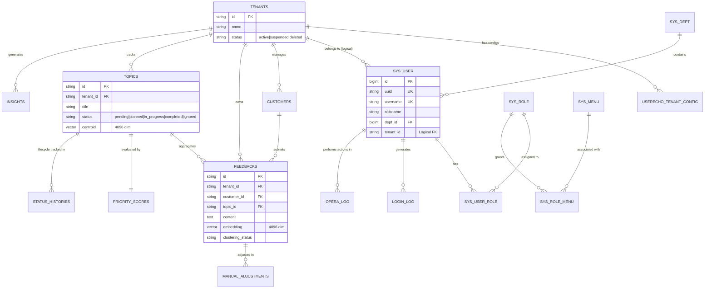

# Feedalyze 数据库设计规格说明书

本文档详细描述了 Feedalyze 系统的数据库架构、实体关系及各表设计详情。

## 一、 核心实体关系图 (ER Diagram)

---

## 二、 系统管理模块 (RBAC)

### 2.1 用户表 (`sys_user`)
存储后台管理员及业务人员信息。

| 字段名 | 类型 | 描述 | 约束 |
| :--- | :--- | :--- | :--- |
| `id` | BigInteger | 主键 ID | PK, AutoInc |
| `uuid` | String(64) | 用户唯一标识 | Unique |
| `username` | String(64) | 用户名 | Unique, Index |
| `nickname` | String(64) | 昵称 | |
| `password` | String(256) | 哈希密码 | |
| `email` | String(256) | 邮箱 | |
| `status` | Integer | 账号状态 (0停用 1正常) | |
| `is_superuser` | Boolean | 是否为超级管理员 | |
| `dept_id` | BigInteger | 部门 ID | 逻辑外键 |
| `tenant_id` | String(36) | 租户 ID | 逻辑外键 |

### 2.2 角色表 (`sys_role`) & 菜单表 (`sys_menu`)
控制系统功能访问权限。
- **关联表**: `sys_user_role` (用户-角色), `sys_role_menu` (角色-菜单)。

---

## 三、 核心业务模块 (UserEcho)

### 3.1 租户表 (`tenants`)
系统的顶级容器，实现物理级的数据隔离基础。

| 字段名 | 类型 | 描述 | 约束 |
| :--- | :--- | :--- | :--- |
| `id` | String(36) | 租户 UUID | PK |
| `name` | String(100) | 租户名称 | |
| `status` | String(20) | 状态 (active/suspended) | |

### 3.2 客户表 (`customers`)
反馈的来源主体，用于计算商业权重。

| 字段名 | 类型 | 描述 | 约束 |
| :--- | :--- | :--- | :--- |
| `id` | String(36) | 客户 UUID | PK |
| `tenant_id` | String(36) | 所属租户 | FK(tenants.id) |
| `name` | String(100) | 客户名称 | |
| `customer_type` | String(20) | 客户等级 (paid/strategic 等) | |
| `business_value` | Integer | 商业价值权重 (1-10) | |

### 3.3 反馈表 (`feedbacks`)
存储原始的用户声音，支持向量检索和 AI 处理。

| 字段名 | 类型 | 描述 | 约束 |
| :--- | :--- | :--- | :--- |
| `id` | String(36) | 反馈 UUID | PK |
| `tenant_id` | String(36) | 所属租户 | FK(tenants.id) |
| `customer_id` | String(36) | 关联客户 | FK(customers.id) |
| `topic_id` | String(36) | 关联主题 | FK(topics.id) |
| `content` | Text | 反馈正文 | |
| `source` | String(20) | 来源 (manual/api/screenshot) | |
| `embedding` | Vector(4096) | 内容特征向量 | pgvector |
| `sentiment` | String(20) | 情感分析结果 (positive/negative) | |
| `clustering_status`| String(20) | 聚类状态 (pending/clustered) | |

### 3.4 需求主题表 (`topics`)
AI 聚类后生成的核心需求实体。

| 字段名 | 类型 | 描述 | 约束 |
| :--- | :--- | :--- | :--- |
| `id` | String(36) | 主题 UUID | PK |
| `tenant_id` | String(36) | 所属租户 | FK(tenants.id) |
| `title` | String(100) | 主题标题 | |
| `category` | String(20) | 分类 (bug/feature/performance) | |
| `status` | String(20) | 研发进度状态 (planned/in_progress 等) | |
| `centroid` | Vector(4096) | 主题中心向量 | 用户增量聚类匹配 |
| `feedback_count` | Integer | 关联的反馈总数 | 冗余统计 |

---

## 四、 评估与溯源模块

### 4.1 优先级评分表 (`priority_scores`)
基于 RICE 或相似模型的量化评分。

| 字段名 | 类型 | 描述 | 约束 |
| :--- | :--- | :--- | :--- |
| `topic_id` | String(36) | 关联主题 | FK(topics.id), Unique |
| `impact_scope` | Integer | 影响范围评分 (1-10) | |
| `business_value` | Integer | 业务价值评分 (1-10) | |
| `dev_cost` | Integer | 开发成本评分 (1-10) | |
| `total_score` | Float | 最终计算出的优先级分数 | |

### 4.2 状态/人工调整记录
- **`status_histories`**: 记录主题状态从 `pending` 到 `completed` 的全过程。
- **`manual_adjustments`**: 记录人工将反馈从 A 主题移动到 B 主题的行为，用于纠偏 AI 模型。

---

## 五、 基础设施模块

### 5.1 异步任务管理 (`task_scheduler` & `task_result`)
- 用于处理耗时的 AI 聚类、大批量导入和报表生成任务。
- 基于 Celery 架构，记录任务的执行策略及最终执行回执。

### 5.2 日志审计
- **`sys_login_log`**: 记录用户登录轨迹（IP、设备、时间）。
- **`sys_opera_log`**: 记录敏感操作记录。

---

## 六、 设计亮点

1. **向量化原生支持**: 采用 `pgvector` 存储 4096 维向量，直接在数据库层实现高效的语义搜索和重心聚类。
2. **严格多租户**: 所有业务操作天然基于 `tenant_id` 过滤，确保 SaaS 架构下的数据隔离安全。
3. **审计闭环**: 无论是状态变更还是 AI 聚类的人工干预，均有专门的日志表进行溯源，支持系统自我迭代。
