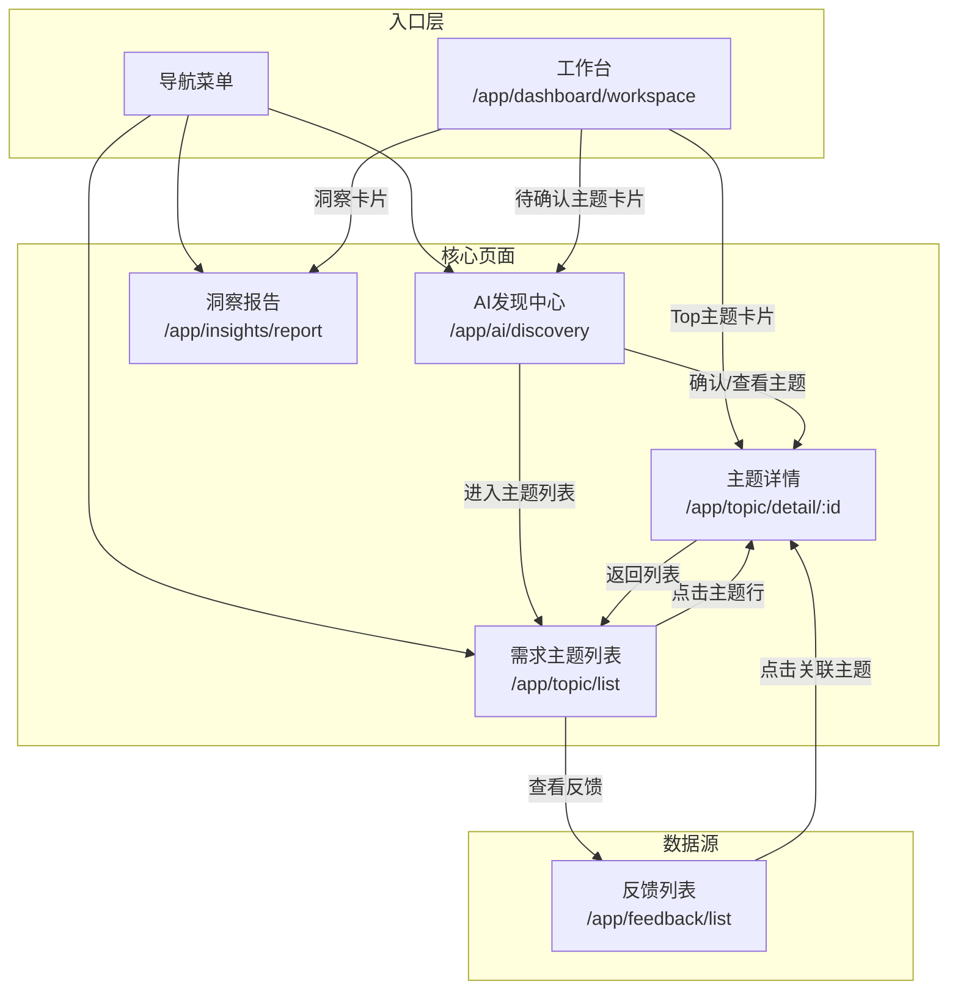
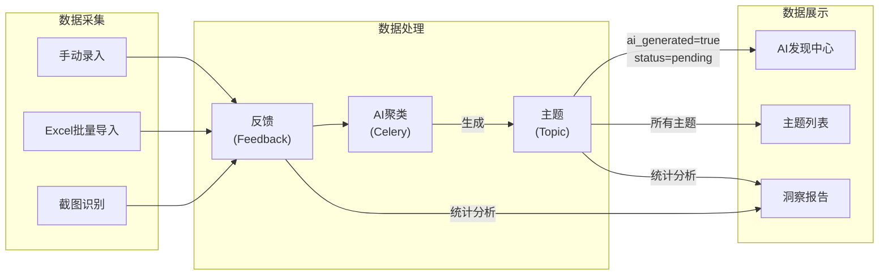

# 页面关系与跳转流程

本文档梳理了 **发现列表**、**AI发现中心**、**需求主题** 和 **洞察报告** 四个核心页面的关系和跳转流程。

---

## 页面概览

| 页面名称 | 路由路径 | 组件文件 | 核心功能 |
|---------|---------|---------|---------|
| AI发现中心 | `/app/ai/discovery` | `discovery/index.vue` | 审核 AI 自动生成的主题，确认或忽略 |
| 需求主题列表 | `/app/topic/list` | `topic/list.vue` | 管理所有主题，筛选、搜索、新增、编辑 |
| 主题详情 | `/app/topic/detail/:id` | `topic/detail.vue` | 查看单个主题的详细信息和关联反馈 |
| 洞察报告 | `/app/insights/report` | `insights/report.vue` | AI 生成的周报/月报分析报告 |

---

## 页面关系图

---

## 跳转流程详解

### 1. AI发现中心 → 其他页面

**位置**: `discovery/index.vue`

| 触发操作 | 目标页面 | 代码位置 |
|---------|---------|---------|
| 点击「进入主题列表」按钮 | `/app/topic/list` | Line 131 |
| 点击列表项的「查看」按钮 | `/app/topic/detail/:id` | Line 192 |
| 点击主题标题 | `/app/topic/detail/:id` | Line 201 |

**业务逻辑**:
- AI 发现中心展示所有 `ai_generated=true` 的主题
- 用户可以「确认」将主题状态改为 `planned`，或「忽略」改为 `ignored`
- 确认/忽略后刷新列表并更新菜单角标数字

---

### 2. 需求主题列表 → 其他页面

**位置**: `topic/list.vue`

| 触发操作 | 目标页面 | 代码位置 |
|---------|---------|---------|
| 点击表格行的主题标题 | `/app/topic/detail/:id` | Line 395, 412 |
| 表格操作列点击「详情」 | `/app/topic/detail/:id` | Line 195 |
| 工具栏「查看反馈」按钮 | `/app/feedback/list` | Line 356 |

**业务逻辑**:
- 主题列表支持按看板（Board）、状态、分类筛选
- 支持关键词搜索
- 筛选条件保存到 LocalStorage，下次访问自动恢复

---

### 3. 主题详情 → 其他页面

**位置**: `topic/detail.vue`

| 触发操作 | 目标页面 | 代码位置 |
|---------|---------|---------|
| 点击顶部「返回列表」按钮 | `/app/topic/list` | Line 155 |

**业务逻辑**:
- 展示主题的完整信息：标题、描述、分类、状态
- 展示优先级评分卡片（可手动计算或自动计算）
- 展示关联的反馈列表
- 展示状态变更历史时间线
- 支持快速更新状态：确认→计划中→进行中→已完成→忽略

---

### 4. 洞察报告

**位置**: `insights/report.vue`

| 触发操作 | 目标页面 | 说明 |
|---------|---------|------|
| 无主动跳转 | - | 洞察报告为独立页面，不跳转到其他页面 |

**业务逻辑**:
- 支持选择时间范围：本周 / 本月
- 异步生成 AI 洞察报告（Celery 任务）
- 轮询任务状态，完成后渲染 Markdown
- 支持导出为 `.md` 文件或复制到剪贴板

---

### 5. 工作台与 Dashboard 组件

**位置**: `dashboard/workspace.vue` 及其子组件

| Dashboard 组件 | 点击跳转目标 | 说明 |
|---------------|-------------|------|
| `TopTopicsCard` | `/app/topic/detail/:id` | 点击高优先级主题 |
| `UrgentTopicsCard` | `/app/topic/detail/:id` | 点击紧急主题 |
| `InsightsCard` | `/app/insights/report` | 点击查看完整报告 |
| `InsightsCard` | `/app/topic/detail/:id` | 点击报告中提到的主题 |

---

## 数据流向

---

## 关键概念说明

### 主题状态 (Topic Status)

| 状态值 | 中文名 | 说明 |
|-------|-------|------|
| `pending` | 待确认 | AI 生成的主题默认状态，等待人工审核 |
| `planned` | 已计划 | 用户确认该主题需要处理 |
| `in_progress` | 进行中 | 主题正在开发/处理中 |
| `completed` | 已完成 | 主题已交付 |
| `ignored` | 已忽略 | 用户判断该主题无需处理 |

### 主题来源

| 字段 | 说明 |
|-----|------|
| `ai_generated=true` | AI 聚类自动生成的主题 |
| `ai_generated=false` | 用户手动创建的主题 |

### AI 质量标识

| 字段 | 说明 |
|-----|------|
| `is_noise=true` | AI 判断为噪声/低质量主题，建议隐藏 |
| `ai_confidence` | AI 置信度分数 (0-1) |
| `cluster_quality` | 聚类质量详情 |

---

## 文件索引

| 文件路径 | 说明 |
|---------|------|
| `views/userecho/discovery/index.vue` | AI 发现中心页面 |
| `views/userecho/topic/list.vue` | 主题列表页面 |
| `views/userecho/topic/detail.vue` | 主题详情页面 |
| `views/userecho/insights/report.vue` | 洞察报告页面 |
| `router/routes/modules/userecho.ts` | 路由配置 |
| `api/userecho/topic.ts` | 主题 API |
| `api/userecho/insight.ts` | 洞察报告 API |
| `store/topic.ts` | 主题状态管理（含待确认数角标） |
