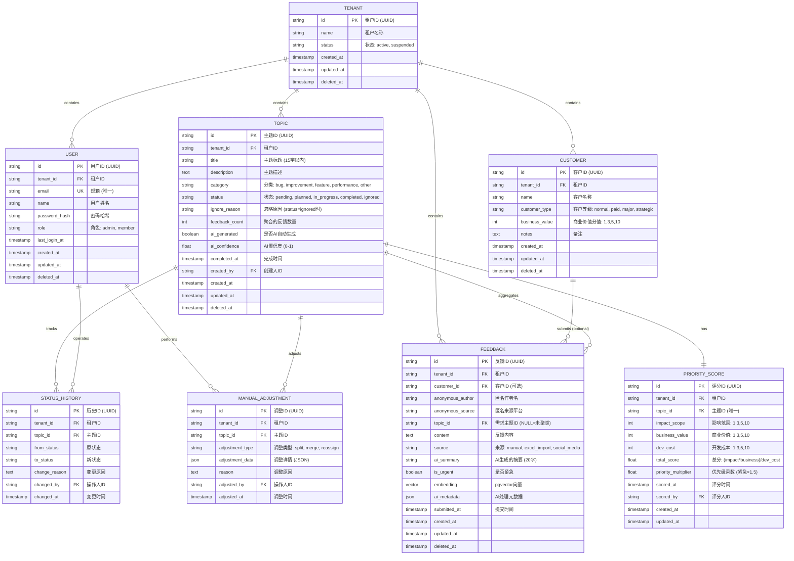

# Feedalyze 数据库设计文档

> **版本:** v1.0  
> **更新日期:** 2025-12-21  
> **状态:** MVP 阶段

---

## 一、设计原则

### 1. Data Structure First (数据结构优先)
> "Bad programmers worry about the code. Good programmers worry about data structures." - Linus Torvalds

- 先设计清晰的实体关系,代码自然简单
- 消除特殊情况,让数据结构本身表达业务逻辑
- 每个表职责单一,避免冗余字段

### 2. 多租户隔离 (Row-Level Isolation)
- **所有业务表必须包含 `tenant_id`**
- 所有查询必须强制带租户过滤 (WHERE tenant_id = ?)
- 租户间数据完全隔离,无需物理分库

### 3. 审计追踪 (Audit Trail)
- 关键操作记录操作人和时间戳
- 使用独立的历史记录表,不污染主表
- 支持数据溯源和问题排查

### 4. 软删除策略
- 业务数据使用软删除 (`deleted_at` 字段)
- 保留历史数据用于分析和恢复
- 查询时默认过滤已删除数据

---

## 二、核心实体关系图 (ER Diagram)



---

## 三、表设计详情

### 3.1 租户表 (tenants)

**职责:** 多租户隔离的根基,所有业务数据的隔离边界

```sql
CREATE TABLE tenants (
    id VARCHAR(36) PRIMARY KEY DEFAULT (UUID()),
    name VARCHAR(100) NOT NULL,
    status ENUM('active', 'suspended', 'deleted') DEFAULT 'active',
    created_at TIMESTAMP DEFAULT CURRENT_TIMESTAMP,
    updated_at TIMESTAMP DEFAULT CURRENT_TIMESTAMP ON UPDATE CURRENT_TIMESTAMP,
    deleted_at TIMESTAMP NULL,
    
    INDEX idx_status (status),
    INDEX idx_deleted_at (deleted_at)
) ENGINE=InnoDB DEFAULT CHARSET=utf8mb4 COLLATE=utf8mb4_unicode_ci;
```

**字段说明:**
- `status`: 租户状态,支持停用但保留数据
- `deleted_at`: 软删除,租户注销后数据归档

---

### 3.2 用户表 (users)

**职责:** 记录系统操作人,用于审计追踪

```sql
CREATE TABLE users (
    id VARCHAR(36) PRIMARY KEY DEFAULT (UUID()),
    tenant_id VARCHAR(36) NOT NULL,
    email VARCHAR(255) NOT NULL,
    name VARCHAR(100) NOT NULL,
    password_hash VARCHAR(255) NOT NULL,
    role ENUM('admin', 'member') DEFAULT 'member',
    last_login_at TIMESTAMP NULL,
    created_at TIMESTAMP DEFAULT CURRENT_TIMESTAMP,
    updated_at TIMESTAMP DEFAULT CURRENT_TIMESTAMP ON UPDATE CURRENT_TIMESTAMP,
    deleted_at TIMESTAMP NULL,
    
    UNIQUE KEY uk_tenant_email (tenant_id, email),
    INDEX idx_tenant_id (tenant_id),
    INDEX idx_deleted_at (deleted_at),
    
    FOREIGN KEY (tenant_id) REFERENCES tenants(id) ON DELETE CASCADE
) ENGINE=InnoDB DEFAULT CHARSET=utf8mb4 COLLATE=utf8mb4_unicode_ci;
```

**关键设计:**
- `uk_tenant_email`: 同一租户内邮箱唯一,不同租户可重复
- `role`: MVP 阶段只有 admin/member 两种角色
- `password_hash`: 使用 bcrypt 或 Argon2 哈希

---

### 3.3 客户表 (customers)

**职责:** 存储反馈来源客户,用于计算商业价值

```sql
CREATE TABLE customers (
    id VARCHAR(36) PRIMARY KEY DEFAULT (UUID()),
    tenant_id VARCHAR(36) NOT NULL,
    name VARCHAR(100) NOT NULL,
    customer_type ENUM('normal', 'paid', 'major', 'strategic') DEFAULT 'normal',
    business_value TINYINT NOT NULL DEFAULT 1 COMMENT '商业价值分值: 1,3,5,10',
    notes TEXT NULL,
    created_at TIMESTAMP DEFAULT CURRENT_TIMESTAMP,
    updated_at TIMESTAMP DEFAULT CURRENT_TIMESTAMP ON UPDATE CURRENT_TIMESTAMP,
    deleted_at TIMESTAMP NULL,
    
    INDEX idx_tenant_id (tenant_id),
    INDEX idx_customer_type (customer_type),
    INDEX idx_deleted_at (deleted_at),
    
    FOREIGN KEY (tenant_id) REFERENCES tenants(id) ON DELETE CASCADE
) ENGINE=InnoDB DEFAULT CHARSET=utf8mb4 COLLATE=utf8mb4_unicode_ci;
```

**字段说明:**
- `customer_type`: 对应 MVP 文档的 4 种客户等级
- `business_value`: 根据 `customer_type` 自动计算:
  - normal → 1
  - paid → 3
  - major → 5
  - strategic → 10

**触发器 (可选):**
```sql
-- 自动同步 customer_type 和 business_value
CREATE TRIGGER trg_customer_business_value 
BEFORE INSERT ON customers
FOR EACH ROW
SET NEW.business_value = CASE NEW.customer_type
    WHEN 'normal' THEN 1
    WHEN 'paid' THEN 3
    WHEN 'major' THEN 5
    WHEN 'strategic' THEN 10
END;
```

---

### 3.4 原始反馈表 (feedbacks)

**职责:** 存储用户提交的原始反馈,是 AI 处理的输入源

```sql
CREATE TABLE feedbacks (
    id VARCHAR(36) PRIMARY KEY DEFAULT (UUID()),
    tenant_id VARCHAR(36) NOT NULL,
    customer_id VARCHAR(36) NULL COMMENT '已知客户ID,匿名反馈时为NULL',
    anonymous_author VARCHAR(100) NULL COMMENT '匿名作者名称(如"小红书用户123")',
    anonymous_source VARCHAR(50) NULL COMMENT '匿名来源平台(xiaohongshu/zhihu/weibo等)',
    topic_id VARCHAR(36) NULL COMMENT 'NULL表示未聚类',
    content TEXT NOT NULL,
    source ENUM('manual', 'excel_import', 'api', 'social_media') DEFAULT 'manual',
    ai_summary VARCHAR(50) NULL COMMENT 'AI生成的20字摘要',
    is_urgent BOOLEAN DEFAULT FALSE,
    embedding VECTOR(768) NULL COMMENT 'pgvector向量字段',
    ai_metadata JSON NULL COMMENT '存储AI处理元数据',
    submitted_at TIMESTAMP DEFAULT CURRENT_TIMESTAMP,
    created_at TIMESTAMP DEFAULT CURRENT_TIMESTAMP,
    updated_at TIMESTAMP DEFAULT CURRENT_TIMESTAMP ON UPDATE CURRENT_TIMESTAMP,
    deleted_at TIMESTAMP NULL,
    
    INDEX idx_tenant_id (tenant_id),
    INDEX idx_customer_id (customer_id),
    INDEX idx_topic_id (topic_id),
    INDEX idx_is_urgent (is_urgent),
    INDEX idx_submitted_at (submitted_at),
    INDEX idx_deleted_at (deleted_at),
    INDEX idx_anonymous_source (anonymous_source),
    -- pgvector 向量索引
    INDEX idx_embedding USING ivfflat (embedding vector_cosine_ops) WITH (lists = 100),
    
    FOREIGN KEY (tenant_id) REFERENCES tenants(id) ON DELETE CASCADE,
    FOREIGN KEY (customer_id) REFERENCES customers(id) ON DELETE SET NULL,
    FOREIGN KEY (topic_id) REFERENCES topics(id) ON DELETE SET NULL,
    
    -- 业务约束：要么有customer_id，要么有anonymous_author
    CONSTRAINT chk_author_exists CHECK (
        customer_id IS NOT NULL OR anonymous_author IS NOT NULL
    )
) ENGINE=InnoDB DEFAULT CHARSET=utf8mb4 COLLATE=utf8mb4_unicode_ci;
```

**关键设计:**

**1. 匿名反馈支持 (核心变更)**
```sql
customer_id NULL              -- 已知客户时填写
anonymous_author VARCHAR(100) -- 匿名用户时填写（如"小红书用户夏天"）
anonymous_source VARCHAR(50)  -- 匿名来源平台
```

**为什么这样设计？**
- 真实场景：社交媒体、官网留言、未登录用户反馈
- NULL 诚实地表达"没有客户记录"这个事实
- 保留原始作者信息，便于后续分析和溯源
- 业务约束：必须二选一（要么有客户，要么有作者名）

**2. 向量存储 (pgvector)**
- `embedding VECTOR(768)`: 直接存储在 PostgreSQL
- 使用 IVFFlat 索引 (Inverted File with Flat quantization)
- 相似度计算：Cosine Similarity

**3. AI 元数据**
```json
{
  "model": "deepseek-v3",
  "processed_at": "2025-12-21T10:00:00Z",
  "confidence": 0.85,
  "cluster_candidates": ["topic-1", "topic-2"]
}
```

**4. 外键约束优化**
- `customer_id`: CASCADE → SET NULL (客户删除不影响反馈)
- `topic_id`: SET NULL (主题删除后反馈变回未聚类状态)

---

### 3.5 需求主题表 (topics)

**职责:** AI 聚类后生成的需求主题,是核心业务实体

```sql
CREATE TABLE topics (
    id VARCHAR(36) PRIMARY KEY DEFAULT (UUID()),
    tenant_id VARCHAR(36) NOT NULL,
    title VARCHAR(50) NOT NULL COMMENT '主题标题,15字以内',
    description TEXT NULL,
    category ENUM('bug', 'improvement', 'feature', 'performance', 'other') DEFAULT 'other',
    status ENUM('pending', 'planned', 'in_progress', 'completed', 'ignored') DEFAULT 'pending',
    ignore_reason TEXT NULL,
    feedback_count INT DEFAULT 0 COMMENT '聚合的反馈数量',
    ai_generated BOOLEAN DEFAULT TRUE,
    ai_confidence DECIMAL(3,2) DEFAULT 0.00 COMMENT 'AI置信度 0.00-1.00',
    completed_at TIMESTAMP NULL,
    created_by VARCHAR(36) NULL,
    created_at TIMESTAMP DEFAULT CURRENT_TIMESTAMP,
    updated_at TIMESTAMP DEFAULT CURRENT_TIMESTAMP ON UPDATE CURRENT_TIMESTAMP,
    deleted_at TIMESTAMP NULL,
    
    INDEX idx_tenant_id (tenant_id),
    INDEX idx_status (status),
    INDEX idx_category (category),
    INDEX idx_ai_confidence (ai_confidence),
    INDEX idx_created_at (created_at),
    INDEX idx_deleted_at (deleted_at),
    
    FOREIGN KEY (tenant_id) REFERENCES tenants(id) ON DELETE CASCADE,
    FOREIGN KEY (created_by) REFERENCES users(id) ON DELETE SET NULL
) ENGINE=InnoDB DEFAULT CHARSET=utf8mb4 COLLATE=utf8mb4_unicode_ci;
```

**字段说明:**
- `feedback_count`: 冗余字段,方便快速查询 (每次聚类更新时同步)
- `ai_confidence < 0.7`: 标记为"待人工确认"
- `status = 'completed'` 时,`completed_at` 自动记录

**触发器 (可选):**
```sql
-- 自动设置完成时间
CREATE TRIGGER trg_topic_completed 
BEFORE UPDATE ON topics
FOR EACH ROW
IF NEW.status = 'completed' AND OLD.status != 'completed' THEN
    SET NEW.completed_at = CURRENT_TIMESTAMP;
END IF;
```

---

### 3.6 优先级评分表 (priority_scores)

**职责:** 存储需求主题的优先级评分,独立于主题表

```sql
CREATE TABLE priority_scores (
    id VARCHAR(36) PRIMARY KEY DEFAULT (UUID()),
    tenant_id VARCHAR(36) NOT NULL,
    topic_id VARCHAR(36) NOT NULL,
    impact_scope TINYINT NOT NULL COMMENT '影响范围: 1,3,5,10',
    business_value TINYINT NOT NULL COMMENT '商业价值: 1,3,5,10',
    dev_cost TINYINT NOT NULL COMMENT '开发成本: 1,3,5,10',
    total_score DECIMAL(10,2) NOT NULL COMMENT '总分=(影响*价值)/成本',
    priority_multiplier DECIMAL(3,2) DEFAULT 1.00 COMMENT '紧急系数: 1.0或1.5',
    scored_at TIMESTAMP DEFAULT CURRENT_TIMESTAMP,
    scored_by VARCHAR(36) NULL,
    created_at TIMESTAMP DEFAULT CURRENT_TIMESTAMP,
    updated_at TIMESTAMP DEFAULT CURRENT_TIMESTAMP ON UPDATE CURRENT_TIMESTAMP,
    
    UNIQUE KEY uk_topic_id (topic_id),
    INDEX idx_tenant_id (tenant_id),
    INDEX idx_total_score (total_score DESC),
    
    FOREIGN KEY (tenant_id) REFERENCES tenants(id) ON DELETE CASCADE,
    FOREIGN KEY (topic_id) REFERENCES topics(id) ON DELETE CASCADE,
    FOREIGN KEY (scored_by) REFERENCES users(id) ON DELETE SET NULL
) ENGINE=InnoDB DEFAULT CHARSET=utf8mb4 COLLATE=utf8mb4_unicode_ci;
```

**计算逻辑 (应用层或触发器):**
```sql
total_score = (impact_scope * business_value) / dev_cost * priority_multiplier
```

**为什么独立存储:**
- 便于修改评分算法,不影响历史数据
- 支持 A/B 测试不同的评分公式
- 查询性能优化 (评分变更频繁,不污染主题表)

---

### 3.7 状态变更历史表 (status_histories)

**职责:** 审计追踪需求主题的状态流转

```sql
CREATE TABLE status_histories (
    id VARCHAR(36) PRIMARY KEY DEFAULT (UUID()),
    tenant_id VARCHAR(36) NOT NULL,
    topic_id VARCHAR(36) NOT NULL,
    from_status VARCHAR(20) NOT NULL,
    to_status VARCHAR(20) NOT NULL,
    change_reason TEXT NULL,
    changed_by VARCHAR(36) NULL,
    changed_at TIMESTAMP DEFAULT CURRENT_TIMESTAMP,
    
    INDEX idx_tenant_id (tenant_id),
    INDEX idx_topic_id (topic_id),
    INDEX idx_changed_at (changed_at),
    
    FOREIGN KEY (tenant_id) REFERENCES tenants(id) ON DELETE CASCADE,
    FOREIGN KEY (topic_id) REFERENCES topics(id) ON DELETE CASCADE,
    FOREIGN KEY (changed_by) REFERENCES users(id) ON DELETE SET NULL
) ENGINE=InnoDB DEFAULT CHARSET=utf8mb4 COLLATE=utf8mb4_unicode_ci;
```

**触发器 (自动记录状态变更):**
```sql
CREATE TRIGGER trg_topic_status_change
AFTER UPDATE ON topics
FOR EACH ROW
IF OLD.status != NEW.status THEN
    INSERT INTO status_histories (tenant_id, topic_id, from_status, to_status, changed_by)
    VALUES (NEW.tenant_id, NEW.id, OLD.status, NEW.status, NEW.updated_by);
END IF;
```

---

### 3.8 人工调整记录表 (manual_adjustments)

**职责:** 记录 PM 对 AI 聚类的所有手动调整,用于模型优化

```sql
CREATE TABLE manual_adjustments (
    id VARCHAR(36) PRIMARY KEY DEFAULT (UUID()),
    tenant_id VARCHAR(36) NOT NULL,
    topic_id VARCHAR(36) NOT NULL,
    adjustment_type ENUM('split', 'merge', 'reassign', 'label_change') NOT NULL,
    adjustment_data JSON NOT NULL COMMENT '调整详情',
    reason TEXT NULL,
    adjusted_by VARCHAR(36) NULL,
    adjusted_at TIMESTAMP DEFAULT CURRENT_TIMESTAMP,
    
    INDEX idx_tenant_id (tenant_id),
    INDEX idx_topic_id (topic_id),
    INDEX idx_adjustment_type (adjustment_type),
    INDEX idx_adjusted_at (adjusted_at),
    
    FOREIGN KEY (tenant_id) REFERENCES tenants(id) ON DELETE CASCADE,
    FOREIGN KEY (topic_id) REFERENCES topics(id) ON DELETE CASCADE,
    FOREIGN KEY (adjusted_by) REFERENCES users(id) ON DELETE SET NULL
) ENGINE=InnoDB DEFAULT CHARSET=utf8mb4 COLLATE=utf8mb4_unicode_ci;
```

**adjustment_data 示例:**

**拆分聚类 (split):**
```json
{
  "action": "split",
  "source_topic_id": "topic-123",
  "new_topic_id": "topic-456",
  "moved_feedback_ids": ["fb-1", "fb-2", "fb-3"]
}
```

**合并聚类 (merge):**
```json
{
  "action": "merge",
  "source_topic_ids": ["topic-123", "topic-456"],
  "target_topic_id": "topic-789"
}
```

**重新分配反馈 (reassign):**
```json
{
  "action": "reassign",
  "feedback_id": "fb-1",
  "from_topic_id": "topic-123",
  "to_topic_id": "topic-456"
}
```

---

## 四、索引策略

### 4.1 查询场景分析

| 查询场景 | 频率 | 关键索引 |
|---------|------|---------|
| 按租户查询所有主题 | 极高 | `tenant_id` |
| 按状态筛选主题 | 高 | `(tenant_id, status)` 复合索引 |
| 按优先级排序 | 高 | `total_score DESC` |
| 查询未聚类的反馈 | 中 | `(tenant_id, topic_id)` 其中 topic_id IS NULL |
| 全文搜索反馈内容 | 低 | FULLTEXT `content` |

### 4.2 复合索引建议

```sql
-- 主题列表页高频查询优化
CREATE INDEX idx_topics_list ON topics(tenant_id, status, created_at DESC);

-- 反馈聚类查询优化
CREATE INDEX idx_feedbacks_cluster ON feedbacks(tenant_id, topic_id, submitted_at);

-- 优先级排序优化
CREATE INDEX idx_priority_ranking ON priority_scores(tenant_id, total_score DESC);
```

---

## 五、数据完整性约束

### 5.1 外键约束策略

| 关系 | 删除行为 | 理由 |
|-----|---------|-----|
| `tenant_id` | CASCADE | 租户删除,所有数据级联删除 |
| `customer_id` | RESTRICT | 客户被反馈引用时禁止删除 |
| `topic_id` (feedbacks表) | SET NULL | 主题删除后,反馈变回未聚类状态 |
| `created_by/scored_by` | SET NULL | 用户删除不影响业务数据 |

### 5.2 业务规则约束

```sql
-- 优先级评分字段值必须是 1,3,5,10
ALTER TABLE priority_scores 
ADD CONSTRAINT chk_impact_scope CHECK (impact_scope IN (1,3,5,10)),
ADD CONSTRAINT chk_business_value CHECK (business_value IN (1,3,5,10)),
ADD CONSTRAINT chk_dev_cost CHECK (dev_cost IN (1,3,5,10));

-- AI 置信度必须在 0-1 之间
ALTER TABLE topics
ADD CONSTRAINT chk_ai_confidence CHECK (ai_confidence BETWEEN 0.00 AND 1.00);

-- 反馈内容不能为空
ALTER TABLE feedbacks
ADD CONSTRAINT chk_content_not_empty CHECK (CHAR_LENGTH(TRIM(content)) > 0);
```

---

## 六、性能优化建议

### 6.1 分区策略 (10万+数据量时考虑)

```sql
-- 按租户分区 (Hash Partition)
ALTER TABLE feedbacks 
PARTITION BY HASH(tenant_id) 
PARTITIONS 16;

-- 按时间分区 (Range Partition)
ALTER TABLE status_histories
PARTITION BY RANGE (YEAR(changed_at)) (
    PARTITION p2024 VALUES LESS THAN (2025),
    PARTITION p2025 VALUES LESS THAN (2026),
    PARTITION p_future VALUES LESS THAN MAXVALUE
);
```

### 6.2 向量搜索优化 (pgvector)

**安装 pgvector 插件**
```sql
-- PostgreSQL 14+ 支持
CREATE EXTENSION IF NOT EXISTS vector;

-- 验证安装
SELECT * FROM pg_extension WHERE extname = 'vector';
```

**索引策略**

MVP 阶段使用 **IVFFlat** (速度快，精度够用):
```sql
CREATE INDEX idx_feedbacks_embedding 
ON feedbacks USING ivfflat (embedding vector_cosine_ops) 
WITH (lists = 100);
```

如果数据量 > 10 万，升级为 **HNSW** (更快，内存占用高):
```sql
CREATE INDEX idx_feedbacks_embedding 
ON feedbacks USING hnsw (embedding vector_cosine_ops) 
WITH (m = 16, ef_construction = 64);
```

**相似度查询**
```sql
-- 查找最相似的 10 条反馈
SELECT 
    id, 
    content,
    customer_id,
    anonymous_author,
    1 - (embedding <=> $1::vector) AS similarity
FROM feedbacks
WHERE tenant_id = $2
    AND deleted_at IS NULL
    AND embedding IS NOT NULL
ORDER BY embedding <=> $1::vector
LIMIT 10;
```

**性能参数**
```sql
-- 设置查询精度（越大越准确但越慢）
SET ivfflat.probes = 10;  -- 默认值，适合 MVP

-- 对于 HNSW 索引
SET hnsw.ef_search = 40;  -- 默认值
```

### 6.3 缓存策略

**Redis 缓存层:**
```
# 租户的主题列表 (5分钟过期)
topics:tenant:{tenant_id}:status:{status} → JSON[]

# 主题的反馈列表 (1分钟过期)
feedbacks:topic:{topic_id} → JSON[]

# 优先级排行榜 (10分钟过期)
priority:tenant:{tenant_id}:top100 → ZSET
```

---

## 七、初始化数据

### 7.1 种子数据 (Seed Data)

```sql
-- 创建默认租户
INSERT INTO tenants (id, name, status) 
VALUES ('tenant-demo', 'Demo 租户', 'active');

-- 创建管理员用户
INSERT INTO users (id, tenant_id, email, name, password_hash, role)
VALUES (
    'user-admin',
    'tenant-demo',
    'admin@userecho.com',
    '系统管理员',
    '$2a$10$...',  -- bcrypt hash of 'admin123'
    'admin'
);

-- 创建示例客户
INSERT INTO customers (id, tenant_id, name, customer_type, business_value)
VALUES 
    ('cust-1', 'tenant-demo', '小米科技', 'strategic', 10),
    ('cust-2', 'tenant-demo', '字节跳动', 'major', 5),
    ('cust-3', 'tenant-demo', '普通用户A', 'normal', 1);
```

---

## 八、数据字典

### 8.1 枚举值定义

**客户类型 (customer_type):**
| 值 | 说明 | 商业价值分值 |
|----|-----|-------------|
| `normal` | 普通客户 | 1 |
| `paid` | 付费客户 | 3 |
| `major` | 大客户 | 5 |
| `strategic` | 战略客户 | 10 |

**反馈来源 (source):**
| 值 | 说明 |
|----|-----|
| `manual` | 手动录入 |
| `excel_import` | Excel批量导入 |
| `social_media` | 社交媒体抓取 |
| `api` | API接口 (预留) |

**需求分类 (category):**
| 值 | 说明 | 示例 |
|----|-----|-----|
| `bug` | 功能缺陷 | "登录失败" |
| `improvement` | 体验优化 | "按钮太小" |
| `feature` | 新功能 | "希望支持导出PDF" |
| `performance` | 性能问题 | "加载太慢" |
| `other` | 其他 | "不知道怎么分类" |

**需求状态 (status):**
| 值 | 说明 | 可流转到 |
|----|-----|---------|
| `pending` | 待处理 | planned, ignored |
| `planned` | 计划中 | in_progress, ignored |
| `in_progress` | 进行中 | completed, planned |
| `completed` | 已完成 | - |
| `ignored` | 已忽略 | pending (可恢复) |

---

## 九、迁移脚本

### 9.1 版本控制 (使用 Prisma/TypeORM/Flyway)

```
migrations/
├── 001_create_tenants_and_users.sql
├── 002_create_customers.sql
├── 003_create_feedbacks.sql
├── 004_create_topics.sql
├── 005_create_priority_scores.sql
├── 006_create_audit_tables.sql
└── 007_add_indexes.sql
```

### 9.2 回滚策略

每个迁移文件必须包含 `UP` 和 `DOWN` 脚本:

```sql
-- UP
CREATE TABLE feedbacks (...);

-- DOWN
DROP TABLE IF EXISTS feedbacks;
```

---

## 十、安全考虑

### 10.1 多租户数据隔离

**强制租户过滤 (应用层中间件):**
```typescript
// 所有查询必须经过租户过滤
class TenantAwareRepository {
  find(where: any) {
    return this.repository.find({
      ...where,
      tenant_id: getCurrentTenantId(), // 强制添加
    });
  }
}
```

### 10.2 敏感数据加密

| 字段 | 加密方式 | 说明 |
|-----|---------|-----|
| `password_hash` | bcrypt/Argon2 | 单向哈希,不可逆 |
| `email` | 明文存储 | 需要查询和显示 |
| `ai_metadata` | 明文存储 | JSON数据,不含敏感信息 |

### 10.3 SQL 注入防护

- **使用参数化查询** (ORM 自动处理)
- **禁止字符串拼接 SQL**
- **输入验证** (长度、格式、类型)

---

## 十一、监控指标

### 11.1 数据库性能监控

```sql
-- 慢查询监控 (>1秒的查询)
SELECT * FROM mysql.slow_log 
WHERE query_time > 1 
ORDER BY query_time DESC 
LIMIT 100;

-- 表空间占用
SELECT 
    table_name,
    ROUND((data_length + index_length) / 1024 / 1024, 2) AS size_mb
FROM information_schema.tables
WHERE table_schema = 'userecho'
ORDER BY size_mb DESC;
```

### 11.2 业务指标监控

| 指标 | SQL | 告警阈值 |
|-----|-----|---------|
| 未聚类反馈数量 | `SELECT COUNT(*) FROM feedbacks WHERE topic_id IS NULL` | > 1000 |
| AI置信度<0.7的主题数 | `SELECT COUNT(*) FROM topics WHERE ai_confidence < 0.7` | > 50 |
| 租户数据量 | `SELECT tenant_id, COUNT(*) FROM feedbacks GROUP BY tenant_id` | 单租户 > 10万 |

---

## 十二、FAQ

**Q: 为什么不用 NoSQL (MongoDB)?**  
A: 
- 业务逻辑强依赖关系型数据 (外键、事务)
- 需要复杂的聚合查询 (GROUP BY, JOIN)
- 结构化数据为主,Schema 相对稳定

**Q: 向量搜索为什么不直接用 Pinecone/Weaviate?**  
A: 
- MVP 阶段数据量小 (< 10万条)
- pgvector 性能足够且部署简单
- 避免引入过多外部依赖

**Q: 软删除会不会影响性能?**  
A: 
- 所有查询必须加 `WHERE deleted_at IS NULL`
- 使用索引 `idx_deleted_at` 优化
- 定期归档历史数据 (>1年)

**Q: 多租户为什么不用独立数据库?**  
A: 
- MVP 阶段租户数量少 (< 100)
- Row-Level 隔离开发成本低
- 便于统计和分析跨租户数据

---

**文档维护者:** 技术团队  
**最后更新:** 2025-12-21
