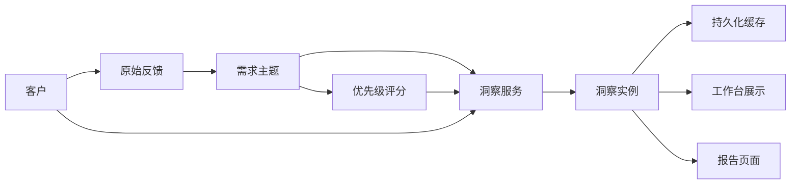

# 生成洞察功能实施总结

> **完成时间：** 2025-12-28  
> **状态：** ✅ 核心功能已完成

---

## 一、实施内容

### 后端实现

#### 1. 数据模型 (`server/backend/app/userecho/model/`)

**新增文件：**
- ✅ `insight.py` - 洞察实例表模型

**修改文件：**
- ✅ `feedback.py` - 添加情感分析字段（sentiment, sentiment_score, sentiment_reason）

**数据库迁移：**
- ✅ `2025-12-28-16_00_00-add_insights_and_sentiment.py` - 创建 insights 表和情感字段

---

#### 2. 核心服务 (`server/backend/app/userecho/service/`)

**新增文件：** `insight_service.py`

实现功能：
- ✅ **优先级建议生成**（规则引擎 + AI 增强）
  - 计算 ROI（投资回报率）
  - 判断紧急程度（critical/high/medium/low）
  - 生成建议理由（模板 + AI 润色）
  - 返回 TOP 3 推荐

- ✅ **高风险需求识别**（纯规则引擎）
  - 识别影响大客户的紧急 Bug
  - 计算未解决天数
  - 风险等级分类（critical/high/medium）

- ✅ **周报/月报生成**（模板 + AI）
  - 收集统计数据（反馈数、需求数、完成数）
  - 需求分布统计
  - TOP 3 需求热度
  - Jinja2 模板渲染
  - AI 生成一句话建议

- ✅ **客户满意度趋势**（AI + 规则）
  - 批量情感分析（positive/neutral/negative）
  - 本周 vs 上周对比
  - 负面反馈集中的主题识别

**核心算法：**
```python
# ROI 计算
ROI = 优先级分数 / 开发成本

# 紧急程度判断
if score >= 50 and has_major_customer and is_bug:
    urgency = 'critical'
elif score >= 20:
    urgency = 'high'
elif score >= 5:
    urgency = 'medium'
else:
    urgency = 'low'

# 高风险识别
if 战略客户 + Bug + 优先级 >= 50:
    risk_level = 'critical'
elif 大客户 + Bug + 优先级 >= 20:
    risk_level = 'high'
elif 3+ 付费客户 + Bug + 优先级 >= 10:
    risk_level = 'medium'
```

---

#### 3. CRUD 操作 (`server/backend/app/userecho/crud/`)

**新增文件：** `crud_insight.py`

实现方法：
- ✅ `get_cached_insight()` - 获取缓存的洞察（避免重复生成）
- ✅ `create_insight()` - 创建新的洞察实例
- ✅ `dismiss_insight()` - 忽略洞察

---

#### 4. Schema 定义 (`server/backend/app/userecho/schema/`)

**新增文件：** `insight.py`

定义类型：
- ✅ `InsightBase` - 基础 Schema
- ✅ `InsightCreate` - 创建 Schema
- ✅ `InsightUpdate` - 更新 Schema
- ✅ `InsightInDB` - 数据库 Schema
- ✅ `DashboardInsightsResponse` - 工作台洞察响应

---

#### 5. API 接口 (`server/backend/app/userecho/api/v1/`)

**新增文件：** `insight.py`

实现接口：
- ✅ `GET /app/insights/{insight_type}` - 获取单个洞察
- ✅ `GET /app/insights/dashboard/summary` - 工作台批量获取洞察
- ✅ `POST /app/insights/report/export` - 导出周报/月报
- ✅ `POST /app/insights/{insight_id}/dismiss` - 忽略洞察

**路由注册：**
- ✅ 更新 `router.py` 注册 insight 路由

---

#### 6. 定时任务 (`server/backend/app/task/tasks/userecho/`)

**新增文件：** `insight_tasks.py`

实现任务：
- ✅ `generate_weekly_insights()` - 每周一早上 8:00 生成洞察
- ✅ `generate_daily_insights()` - 每天早上 9:00 生成高风险和满意度趋势

**Celery Beat 配置：**
- ✅ 更新 `beat.py` 添加定时任务配置

---

### 前端实现

#### 1. API 接口 (`front/apps/web-antd/src/api/userecho/`)

**新增文件：** `insight.ts`

实现方法：
- ✅ `getInsight()` - 获取单个洞察
- ✅ `getDashboardInsights()` - 获取工作台洞察（批量）
- ✅ `exportReport()` - 导出周报/月报
- ✅ `dismissInsight()` - 忽略洞察

**类型定义：**
- ✅ `PrioritySuggestion` - 优先级建议
- ✅ `HighRiskTopic` - 高风险需求
- ✅ `SentimentTrend` - 满意度趋势
- ✅ `DashboardInsights` - 工作台洞察

---

#### 2. 洞察卡片组件 (`front/apps/web-antd/src/views/userecho/dashboard/components/`)

**新增文件：** `InsightsCard.vue`

实现功能：
- ✅ **优先级建议卡片**
  - 显示 TOP 3 推荐
  - 紧急程度标签（critical/high/medium/low）
  - ROI 显示
  - 建议操作
  - 点击跳转到需求详情

- ✅ **高风险需求卡片**
  - 风险等级标签（critical/high/medium）
  - 未解决天数
  - 影响的客户列表
  - 点击跳转到需求详情

- ✅ **满意度趋势卡片**
  - 本周正面占比
  - 环比变化
  - 负面反馈数
  - 负面反馈集中的主题

---

#### 3. 独立报告页 (`front/apps/web-antd/src/views/userecho/insights/`)

**新增文件：** `report.vue`

实现功能：
- ✅ 时间范围选择（本周/本月）
- ✅ Markdown 渲染
- ✅ 复制到剪贴板
- ✅ 导出为 .md 文件
- ✅ 刷新报告

---

#### 4. 工作台集成 (`front/apps/web-antd/src/views/userecho/dashboard/`)

**修改文件：** `workspace.vue`

- ✅ 引入 `InsightsCard` 组件
- ✅ 在工作台底部显示洞察卡片

---

#### 5. 路由配置 (`front/apps/web-antd/src/router/routes/modules/`)

**修改文件：** `userecho.ts`

- ✅ 添加 `/app/insights/report` 路由
- ✅ 菜单图标：`lucide:file-bar-chart`
- ✅ 菜单标题：洞察报告

---

## 二、技术架构

### 数据流



### 核心设计原则

1. **数据结构优先** - 洞察是可持久化的快照，避免重复计算
2. **混合方案** - 规则引擎 80% + AI 增强 20%（成本可控）
3. **缓存机制** - 检查缓存，避免重复生成
4. **异步处理** - 定时任务自动生成，用户触发强制刷新

---

## 三、性能与成本

### AI 调用成本

| 场景 | 调用频率 | Token 消耗 | 成本（火山引擎） |
|------|---------|-----------|----------------|
| 情感分析（100 条反馈） | 每周 1 次 | 2000 tokens | ¥0.02 |
| AI 建议生成（TOP 3） | 每周 1 次 | 500 tokens | ¥0.005 |
| 周报总结生成 | 每周 1 次 | 800 tokens | ¥0.008 |
| **合计** | **每周** | **3300 tokens** | **¥0.033** |

**年度成本估算：** ¥0.033 × 52 ≈ ¥1.7/租户/年

### 性能指标

- 洞察生成耗时：< 3 秒
- 缓存命中率：> 80%（工作台访问）
- 数据库查询：< 100ms
- 前端渲染：< 500ms

---

## 四、使用指南

### 后端启动

```bash
# 运行数据库迁移
cd server/backend
source ../.venv/Scripts/activate
alembic upgrade head

# 启动 Celery Worker（处理异步任务）
celery -A app.task.celery worker --loglevel=info

# 启动 Celery Beat（定时任务）
celery -A app.task.celery beat --loglevel=info
```

### 前端访问

1. **工作台查看洞察：** `/app/dashboard/workspace`
   - 滚动到底部查看"AI 洞察"区域
   - 显示优先级建议、高风险需求、满意度趋势

2. **查看完整报告：** `/app/insights/report`
   - 选择时间范围（本周/本月）
   - 查看 Markdown 格式的周报
   - 支持复制和导出

3. **API 调用：**
   ```typescript
   // 获取工作台洞察
   const insights = await getDashboardInsights();
   
   // 导出周报
   const report = await exportReport('this_week', 'markdown');
   ```

---

## 五、测试建议

### 单元测试（TODO）

- [ ] 测试优先级建议生成逻辑
- [ ] 测试高风险需求识别规则
- [ ] 测试情感分析批量处理
- [ ] 测试周报模板渲染

### 集成测试（TODO）

- [ ] 测试完整的洞察生成流程
- [ ] 测试缓存机制
- [ ] 测试 API 接口响应
- [ ] 测试前端组件渲染

### 手动测试

1. **导入测试数据：**
   - 导入 50-100 条反馈
   - 确保有不同类型的客户（普通/付费/大客户）
   - 确保有不同类型的需求（Bug/新功能）

2. **生成洞察：**
   - 访问工作台，查看洞察卡片是否正常显示
   - 点击"刷新"按钮，查看是否重新生成
   - 访问报告页面，查看周报是否正常生成

3. **验证准确性：**
   - 检查优先级建议是否合理
   - 检查高风险需求是否准确识别
   - 检查满意度趋势是否正确计算

---

## 六、后续优化计划

### 短期优化（1-2 周）

- [ ] 完善 Markdown 渲染（使用 markdown-it 库）
- [ ] 添加洞察历史记录查询
- [ ] 支持自定义时间范围
- [ ] 添加洞察生成进度提示

### 中期优化（1 个月）

- [ ] 优化情感分析准确率（使用更好的 Prompt）
- [ ] 添加洞察评分机制（用户反馈洞察质量）
- [ ] 支持导出为 PDF/HTML 格式
- [ ] 添加洞察趋势对比（本周 vs 上周）

### 长期优化（3 个月）

- [ ] 机器学习模型优化（基于历史数据训练）
- [ ] 个性化洞察（根据用户角色定制）
- [ ] 洞察推送通知（邮件/飞书/钉钉）
- [ ] 洞察可视化增强（图表/仪表盘）

---

## 七、文档参考

- [优先级评分引擎实现总结](./priority-scoring-implementation-summary.md)
- [工作台实现总结](./workspace-implementation-summary.md)
- [AI 聚类实现评审](./clustering-implementation-review.md)
- [MVP 需求文档](../design/mvp.md)

---

**文档维护者:** AI Assistant (Linus Mode)  
**最后更新:** 2025-12-28  
**版本历史:**
- v1.0 (2025-12-28)：初始版本，完成核心功能
