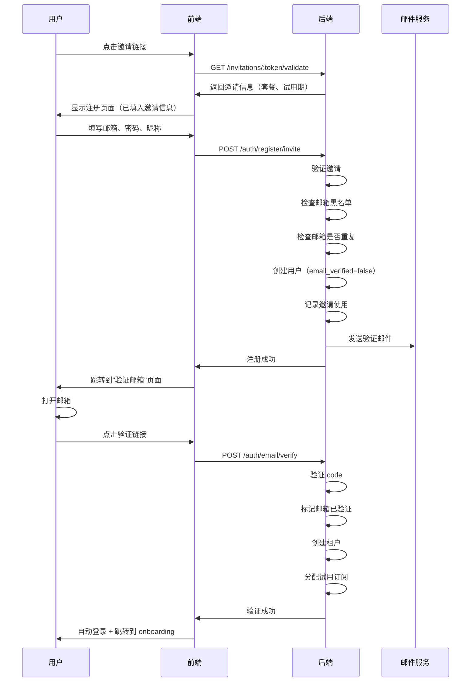

# 邀请 URL 技术方案

> **版本**: v1.0  
> **更新日期**: 2026-01-19  
> **状态**: 待审核

## 一、需求背景

### 业务目标

在 MVP 阶段，需要为内测用户提供免费试用 1 个月的邀请机制，通过邀请 URL 的方式：

- 管理员生成邀请链接，主动发放给目标用户
- 用户点击链接，填写邮箱和密码完成注册
- 注册成功后自动获得**专业版订阅 1 个月**
- 引导用户完成 onboarding 流程（创建团队、看板、邀请成员）

### 核心约束

1. **使用限制**：每个邀请 URL 最多使用 10 次（面向中小企业，用户量不会太大）
2. **唯一性保证**：每个邮箱只能领取一次试用订阅
3. **邮箱验证**：必须验证邮箱后才能完整使用产品
4. **黑名单机制**：拒绝临时邮箱服务商注册

## 二、技术方案设计

### 2.1 数据库设计

#### 2.1.1 邀请表 `invitations`

```sql
CREATE TABLE invitations (
    id VARCHAR(36) PRIMARY KEY DEFAULT uuid_generate_v4(),
    
    -- 邀请标识
    token VARCHAR(64) UNIQUE NOT NULL,  -- 邀请 token（URL 中的唯一标识）
    
    -- 邀请配置
    usage_limit INTEGER NOT NULL DEFAULT 10,  -- 使用次数限制
    used_count INTEGER NOT NULL DEFAULT 0,    -- 已使用次数
    expires_at TIMESTAMP WITH TIME ZONE NOT NULL,  -- 过期时间
    
    -- 订阅配置
    plan_code VARCHAR(20) NOT NULL DEFAULT 'pro',  -- 赋予的套餐代号
    trial_days INTEGER NOT NULL DEFAULT 90,        -- 试用天数
    
    -- 来源标识（数据分析用）
    source VARCHAR(50),           -- 来源标签（如 'wechat', 'email', 'linkedin'）
    campaign VARCHAR(100),        -- 活动标识（如 'mvp-launch', 'beta-test'）
    
    -- 管理信息
    creator_id INTEGER REFERENCES sys_user(id) ON DELETE SET NULL,  -- 创建者
    notes TEXT,                   -- 管理备注
    status VARCHAR(20) NOT NULL DEFAULT 'active',  -- 状态: active/expired/disabled
    
    -- 时间戳
    created_at TIMESTAMP WITH TIME ZONE NOT NULL DEFAULT now(),
    updated_at TIMESTAMP WITH TIME ZONE
);

-- 索引
CREATE INDEX idx_invitations_token ON invitations(token);
CREATE INDEX idx_invitations_status ON invitations(status);
CREATE INDEX idx_invitations_expires ON invitations(expires_at);
CREATE INDEX idx_invitations_creator ON invitations(creator_id);
```

**设计说明**：

- `token`：使用 URL 安全的随机字符串（建议 32 位），如 `a3b2c1d4e5f6g7h8i9j0k1l2m3n4o5p6`
- `usage_limit` & `used_count`：实现使用次数限制
- `source` & `campaign`：支持数据分析，追踪不同渠道的转化率
- `status`：支持手动禁用邀请链接

#### 2.1.2 邀请使用记录表 `invitation_usage`

```sql
CREATE TABLE invitation_usage (
    id VARCHAR(36) PRIMARY KEY DEFAULT uuid_generate_v4(),
    
    -- 关联关系
    invitation_id VARCHAR(36) NOT NULL REFERENCES invitations(id) ON DELETE CASCADE,
    user_id INTEGER NOT NULL REFERENCES sys_user(id) ON DELETE CASCADE,
    
    -- 使用信息
    ip_address VARCHAR(45),       -- IPv4/IPv6
    user_agent TEXT,              -- 浏览器信息
    registered_email VARCHAR(256) NOT NULL,  -- 注册邮箱（冗余存储便于查询）
    
    -- 转化追踪
    completed_onboarding BOOLEAN DEFAULT FALSE,  -- 是否完成引导
    created_tenant_id VARCHAR(36) REFERENCES tenants(id) ON DELETE SET NULL,  -- 创建的租户
    
    -- 时间戳
    used_at TIMESTAMP WITH TIME ZONE NOT NULL DEFAULT now(),
    updated_at TIMESTAMP WITH TIME ZONE
);

-- 索引
CREATE INDEX idx_invitation_usage_invitation ON invitation_usage(invitation_id);
CREATE INDEX idx_invitation_usage_user ON invitation_usage(user_id);
CREATE INDEX idx_invitation_usage_email ON invitation_usage(registered_email);
CREATE INDEX idx_invitation_usage_ip ON invitation_usage(ip_address);
CREATE INDEX idx_invitation_usage_date ON invitation_usage(used_at);

-- 唯一约束：每个用户只能使用一次邀请（允许同一个 user_id 用多个不同邀请）
-- 但实际上我们通过邮箱来防止重复，这里只是记录关系
```

**设计说明**：

- 记录每次邀请使用的详细信息，用于数据分析和防滥用
- `completed_onboarding`：追踪用户是否完成引导流程（后续可用于分析）
- `ip_address` & `user_agent`：用于检测异常行为（如批量注册）

#### 2.1.3 邮箱黑名单表 `email_blacklist`

```sql
CREATE TABLE email_blacklist (
    id VARCHAR(36) PRIMARY KEY DEFAULT uuid_generate_v4(),
    
    -- 黑名单内容
    domain VARCHAR(256) UNIQUE NOT NULL,  -- 邮箱域名（如 '10minutemail.com'）
    
    -- 类型和原因
    type VARCHAR(20) NOT NULL DEFAULT 'disposable',  -- 类型: disposable(临时邮箱)/spam(垃圾)/banned(手动封禁)
    reason TEXT,                         -- 加入黑名单的原因
    
    -- 管理信息
    added_by INTEGER REFERENCES sys_user(id) ON DELETE SET NULL,  -- 添加人
    is_active BOOLEAN NOT NULL DEFAULT TRUE,  -- 是否启用
    
    -- 时间戳
    created_at TIMESTAMP WITH TIME ZONE NOT NULL DEFAULT now(),
    updated_at TIMESTAMP WITH TIME ZONE
);

-- 索引
CREATE INDEX idx_email_blacklist_domain ON email_blacklist(domain);
CREATE INDEX idx_email_blacklist_active ON email_blacklist(is_active) WHERE is_active = TRUE;
```

**设计说明**：

- 支持域名级别的黑名单（不是具体邮箱，而是整个域名）
- 预置常见临时邮箱服务商列表（见附录）
- 支持手动添加和管理

#### 2.1.4 邮箱验证记录表 `email_verifications`

```sql
CREATE TABLE email_verifications (
    id VARCHAR(36) PRIMARY KEY DEFAULT uuid_generate_v4(),
    
    -- 关联用户
    user_id INTEGER NOT NULL REFERENCES sys_user(id) ON DELETE CASCADE,
    email VARCHAR(256) NOT NULL,
    
    -- 验证信息
    verification_code VARCHAR(64) NOT NULL,  -- 验证码/token
    is_verified BOOLEAN NOT NULL DEFAULT FALSE,
    verified_at TIMESTAMP WITH TIME ZONE,
    
    -- 重试控制
    send_count INTEGER NOT NULL DEFAULT 1,   -- 发送次数
    last_sent_at TIMESTAMP WITH TIME ZONE NOT NULL DEFAULT now(),
    
    -- 过期控制
    expires_at TIMESTAMP WITH TIME ZONE NOT NULL,  -- 验证链接过期时间（24小时）
    
    -- 时间戳
    created_at TIMESTAMP WITH TIME ZONE NOT NULL DEFAULT now(),
    updated_at TIMESTAMP WITH TIME ZONE
);

-- 索引
CREATE INDEX idx_email_verifications_user ON email_verifications(user_id);
CREATE INDEX idx_email_verifications_email ON email_verifications(email);
CREATE INDEX idx_email_verifications_code ON email_verifications(verification_code);
CREATE UNIQUE INDEX idx_email_verifications_active ON email_verifications(user_id) 
    WHERE is_verified = FALSE;  -- 一个用户同时只能有一个未验证的记录
```

**设计说明**：

- 支持邮箱验证流程
- `send_count`：防止用户频繁发送验证邮件（限制每分钟最多1次）
- `expires_at`：验证链接 24 小时内有效

#### 2.1.5 用户表扩展字段

需要在现有 `sys_user` 表中添加：

```sql
ALTER TABLE sys_user 
ADD COLUMN IF NOT EXISTS email_verified BOOLEAN DEFAULT FALSE COMMENT '邮箱是否已验证',
ADD COLUMN IF NOT EXISTS invitation_id VARCHAR(36) REFERENCES invitations(id) ON DELETE SET NULL COMMENT '注册时使用的邀请ID';

CREATE INDEX idx_sys_user_invitation ON sys_user(invitation_id);
CREATE INDEX idx_sys_user_email_verified ON sys_user(email_verified);
```

### 2.2 后端接口设计

#### 2.2.1 管理端接口（后台管理）

##### POST `/admin/api/v1/invitations` - 创建邀请

**请求**：

```json
{
  "usage_limit": 10,
  "expires_days": 90,
  "plan_code": "pro",
  "trial_days": 90,
  "source": "wechat",
  "campaign": "mvp-beta-test",
  "notes": "发放给微信群内测用户"
}
```

**响应**：

```json
{
  "code": 200,
  "data": {
    "id": "inv_abc123",
    "token": "a3b2c1d4e5f6g7h8i9j0k1l2m3n4o5p6",
    "url": "https://yourdomain.com/register?invite=a3b2c1d4e5f6g7h8i9j0k1l2m3n4o5p6",
    "short_url": "https://yourdomain.com/i/a3b2c1",
    "qr_code_url": "https://yourdomain.com/api/invitations/a3b2c1d4e5f6g7h8i9j0k1l2m3n4o5p6/qrcode",
    "usage_limit": 10,
    "used_count": 0,
    "expires_at": "2026-04-19T00:00:00Z",
    "status": "active",
    "created_at": "2026-01-19T10:00:00Z"
  },
  "msg": "success"
}
```

**业务逻辑**：

1. 校验创建者权限（需要管理员角色）
2. 生成 32 位 URL 安全的 token（使用 `secrets.token_urlsafe(24)`）
3. 计算过期时间：`now() + expires_days`
4. 创建邀请记录
5. 返回完整 URL、短链接、二维码 URL

##### GET `/admin/api/v1/invitations` - 邀请列表

**查询参数**：

- `page`: 页码（默认 1）
- `size`: 每页数量（默认 20）
- `status`: 状态筛选（active/expired/disabled）
- `source`: 来源筛选
- `campaign`: 活动筛选

**响应**：

```json
{
  "code": 200,
  "data": {
    "items": [
      {
        "id": "inv_abc123",
        "token": "a3b2c1d4...",
        "url": "https://yourdomain.com/register?invite=...",
        "usage_limit": 10,
        "used_count": 3,
        "expires_at": "2026-04-19T00:00:00Z",
        "status": "active",
        "source": "wechat",
        "campaign": "mvp-beta-test",
        "creator": {
          "id": 1,
          "nickname": "Admin"
        },
        "created_at": "2026-01-19T10:00:00Z"
      }
    ],
    "total": 15,
    "page": 1,
    "size": 20
  },
  "msg": "success"
}
```

##### GET `/admin/api/v1/invitations/:id/usage` - 邀请使用详情

**响应**：

```json
{
  "code": 200,
  "data": {
    "invitation": {
      "id": "inv_abc123",
      "token": "a3b2c1d4...",
      "usage_limit": 10,
      "used_count": 3,
      "status": "active"
    },
    "usage_records": [
      {
        "id": "usage_001",
        "user": {
          "id": 101,
          "email": "user@example.com",
          "nickname": "张三"
        },
        "ip_address": "123.45.67.89",
        "completed_onboarding": true,
        "created_tenant": {
          "id": "tenant_001",
          "name": "张三的团队"
        },
        "used_at": "2026-01-19T11:00:00Z"
      }
    ],
    "statistics": {
      "total_used": 3,
      "completed_onboarding": 2,
      "conversion_rate": 0.67
    }
  },
  "msg": "success"
}
```

##### PATCH `/admin/api/v1/invitations/:id` - 更新邀请

**请求**：

```json
{
  "status": "disabled",
  "notes": "临时禁用"
}
```

**支持字段**：`status`, `usage_limit`, `expires_at`, `notes`

##### DELETE `/admin/api/v1/invitations/:id` - 删除邀请

软删除（标记为 disabled），保留使用记录。

---

#### 2.2.2 用户端接口（注册流程）

##### GET `/api/v1/invitations/:token/validate` - 验证邀请有效性

**响应**：

```json
{
  "code": 200,
  "data": {
    "valid": true,
    "plan": {
      "code": "pro",
      "name": "专业版",
      "trial_days": 90
    },
    "expires_at": "2026-04-19T00:00:00Z",
    "remaining_usage": 7
  },
  "msg": "success"
}
```

**错误场景**：

- `invitation_not_found`: 邀请不存在
- `invitation_expired`: 邀请已过期
- `invitation_exhausted`: 使用次数已用完
- `invitation_disabled`: 邀请已被禁用

##### POST `/api/v1/auth/register/invite` - 邀请注册

**请求**：

```json
{
  "invitation_token": "a3b2c1d4e5f6g7h8i9j0k1l2m3n4o5p6",
  "email": "user@example.com",
  "password": "SecurePass123!",
  "nickname": "张三"
}
```

**响应**：

```json
{
  "code": 200,
  "data": {
    "user": {
      "id": 101,
      "email": "user@example.com",
      "nickname": "张三",
      "email_verified": false
    },
    "verification_email_sent": true,
    "next_step": "verify_email"
  },
  "msg": "注册成功，请前往邮箱验证"
}
```

**业务逻辑**（关键）：

```python
async def register_with_invitation(
    db: AsyncSession,
    token: str,
    email: str,
    password: str,
    nickname: str,
    ip_address: str,
    user_agent: str,
) -> dict:
    """
    通过邀请码注册
    
    Returns:
        dict: 包含用户信息和下一步操作的字典
    
    Raises:
        ValueError: 邀请无效、邮箱已注册、邮箱在黑名单等
    """
    # 1. 验证邀请有效性
    invitation = await _validate_invitation(db, token)
    
    # 2. 检查邮箱黑名单
    email_domain = email.split('@')[1].lower()
    blacklist = await email_blacklist_dao.get_by_domain(db, email_domain)
    if blacklist and blacklist.is_active:
        raise ValueError(f'不支持该邮箱域名注册: {email_domain}')
    
    # 3. 检查邮箱是否已注册
    existing_user = await user_dao.get_by_email(db, email)
    if existing_user:
        raise ValueError('该邮箱已被注册')
    
    # 4. 检查邮箱是否已被用于领取试用（防止换账号重复领取）
    existing_usage = await invitation_usage_dao.get_by_email(db, email)
    if existing_usage:
        raise ValueError('该邮箱已领取过试用订阅')
    
    # 5. 创建用户（email_verified=False）
    user = User(
        email=email,
        nickname=nickname,
        password=hash_password(password),
        status=1,  # 正常状态
        email_verified=False,
        invitation_id=invitation.id,
    )
    user = await user_dao.create(db, user)
    
    # 6. 创建邮箱验证记录
    verification = await email_verification_service.create_verification(
        db, user.id, email
    )
    
    # 7. 发送验证邮件
    await email_service.send_verification_email(
        email, 
        verification.verification_code,
        user.nickname
    )
    
    # 8. 记录邀请使用
    usage = InvitationUsage(
        invitation_id=invitation.id,
        user_id=user.id,
        ip_address=ip_address,
        user_agent=user_agent,
        registered_email=email,
    )
    await invitation_usage_dao.create(db, usage)
    
    # 9. 更新邀请使用次数
    await invitation_dao.increment_usage(db, invitation.id)
    
    # 10. 记录日志
    log.info(
        f'User registered with invitation: '
        f'user_id={user.id}, email={email}, invitation={token[:8]}...'
    )
    
    return {
        'user': user,
        'verification_email_sent': True,
        'next_step': 'verify_email',
    }


async def _validate_invitation(db: AsyncSession, token: str) -> Invitation:
    """验证邀请有效性"""
    invitation = await invitation_dao.get_by_token(db, token)
    
    if not invitation:
        raise ValueError('邀请不存在')
    
    if invitation.status != 'active':
        raise ValueError('邀请已失效')
    
    now = timezone.now()
    if invitation.expires_at < now:
        # 自动标记为过期
        await invitation_dao.update(db, invitation, {'status': 'expired'})
        raise ValueError('邀请已过期')
    
    if invitation.used_count >= invitation.usage_limit:
        raise ValueError('邀请使用次数已用完')
    
    return invitation
```

##### POST `/api/v1/auth/email/verify` - 验证邮箱

**请求**：

```json
{
  "verification_code": "verify_abc123def456"
}
```

**响应**：

```json
{
  "code": 200,
  "data": {
    "verified": true,
    "message": "邮箱验证成功，订阅已激活"
  },
  "msg": "success"
}
```

**业务逻辑**：

```python
async def verify_email(
    db: AsyncSession,
    user_id: int,
    verification_code: str,
) -> dict:
    """
    验证邮箱并激活订阅
    
    核心流程：
    1. 验证 code 有效性
    2. 标记邮箱已验证
    3. 创建租户（如果不存在）
    4. 分配专业版试用订阅
    """
    # 1. 查找验证记录
    verification = await email_verification_dao.get_by_code(db, verification_code)
    if not verification or verification.user_id != user_id:
        raise ValueError('验证码无效')
    
    if verification.is_verified:
        raise ValueError('该验证码已使用')
    
    now = timezone.now()
    if verification.expires_at < now:
        raise ValueError('验证码已过期')
    
    # 2. 更新用户邮箱验证状态
    user = await user_dao.get(db, user_id)
    await user_dao.update(db, user, {'email_verified': True})
    
    # 3. 标记验证记录为已验证
    await email_verification_dao.update(
        db, 
        verification, 
        {'is_verified': True, 'verified_at': now}
    )
    
    # 4. 获取邀请信息
    if not user.invitation_id:
        # 没有邀请记录，不分配试用（兜底逻辑）
        log.warning(f'User {user_id} verified email but has no invitation')
        return {'verified': True, 'message': '邮箱验证成功'}
    
    invitation = await invitation_dao.get(db, user.invitation_id)
    
    # 5. 检查用户是否已有租户
    tenant_user = await tenant_user_dao.get_by_user_id(db, user_id)
    
    if tenant_user:
        # 用户已有租户，只需确保订阅正确
        tenant_id = tenant_user.tenant_id
    else:
        # 用户还没有租户，创建一个默认租户（后续在 onboarding 中可以修改）
        tenant = Tenant(
            id=uuid4_str(),
            name=f"{user.nickname}的团队",
            slug=f"team-{uuid4_str()[:8]}",
            status='active',
        )
        tenant = await tenant_dao.create(db, tenant)
        
        # 创建租户关联
        tenant_user = TenantUser(
            id=uuid4_str(),
            tenant_id=tenant.id,
            user_id=user_id,
            user_type='admin',
            status='active',
        )
        await tenant_user_dao.create(db, tenant_user)
        tenant_id = tenant.id
    
    # 6. 分配试用订阅（关键）
    plan = await subscription_plan_dao.get_by_code(db, invitation.plan_code)
    if not plan:
        log.error(f'Plan {invitation.plan_code} not found')
        raise ValueError('套餐配置错误，请联系管理员')
    
    # 检查是否已有订阅
    existing_sub = await tenant_subscription_dao.get_by_tenant(db, tenant_id)
    
    if existing_sub:
        # 如果已有订阅，检查是否是试用订阅，如果是则延长
        if existing_sub.status == SubscriptionStatus.TRIAL:
            new_expires = timezone.now() + timedelta(days=invitation.trial_days)
            await tenant_subscription_dao.update(
                db,
                existing_sub,
                {'expires_at': new_expires, 'trial_ends_at': new_expires}
            )
            log.info(f'Extended trial subscription for tenant {tenant_id}')
        else:
            log.warning(f'Tenant {tenant_id} already has active subscription')
    else:
        # 创建新的试用订阅
        expires_at = timezone.now() + timedelta(days=invitation.trial_days)
        subscription = TenantSubscription(
            tenant_id=tenant_id,
            plan_id=plan.id,
            status=SubscriptionStatus.TRIAL,
            started_at=timezone.now(),
            expires_at=expires_at,
            trial_ends_at=expires_at,
            source=SubscriptionSource.MANUAL,
            notes=f'通过邀请注册获得试用订阅（邀请ID: {invitation.id}）',
        )
        await tenant_subscription_dao.create(db, subscription)
        
        # 记录订阅历史
        await subscription_service._record_history(
            db,
            tenant_id,
            subscription.id,
            SubscriptionAction.CREATED,
            None,
            plan.code,
            reason=f'Invitation registration: {invitation.token[:8]}...',
        )
        
        # 同步积分
        await credits_service.sync_subscription_plan(
            db, tenant_id, plan.code, plan.ai_credits_monthly
        )
        
        log.info(
            f'Created trial subscription for tenant {tenant_id}: '
            f'{plan.code} for {invitation.trial_days} days'
        )
    
    return {
        'verified': True,
        'message': '邮箱验证成功，订阅已激活',
    }
```

##### POST `/api/v1/auth/email/resend` - 重新发送验证邮件

**请求**：

```json
{
  "email": "user@example.com"
}
```

**限制**：同一邮箱 1 分钟内只能发送一次。

---

#### 2.2.3 邮箱黑名单管理接口

##### GET `/admin/api/v1/email-blacklist` - 黑名单列表

##### POST `/admin/api/v1/email-blacklist` - 添加黑名单

**请求**：

```json
{
  "domain": "temp-mail.org",
  "type": "disposable",
  "reason": "临时邮箱服务商"
}
```

##### DELETE `/admin/api/v1/email-blacklist/:id` - 移除黑名单

---

### 2.3 前端交互流程

#### 2.3.1 用户注册流程



#### 2.3.2 页面设计

##### 邀请注册页面 `/register?invite=xxx`

**布局**：

```
┌─────────────────────────────────────────┐
│         UserEcho Logo                    │
├─────────────────────────────────────────┤
│                                          │
│  🎉 你已被邀请加入 UserEcho 内测         │
│                                          │
│  ✅ 专业版功能免费体验 3 个月             │
│  ✅ 无限反馈收集                          │
│  ✅ AI 智能聚类                           │
│  ✅ 500 AI 积分/月                        │
│                                          │
│  ┌────────────────────────────────────┐ │
│  │ 邮箱                                │ │
│  │ [user@example.com]                 │ │
│  └────────────────────────────────────┘ │
│                                          │
│  ┌────────────────────────────────────┐ │
│  │ 密码                                │ │
│  │ [••••••••]                         │ │
│  └────────────────────────────────────┘ │
│  密码强度: ████████░░ 中等               │
│                                          │
│  ┌────────────────────────────────────┐ │
│  │ 昵称                                │ │
│  │ [张三]                             │ │
│  └────────────────────────────────────┘ │
│                                          │
│  [立即开始免费体验 →]                    │
│                                          │
│  注册即表示同意《服务条款》和《隐私政策》 │
│                                          │
│  已有账号？[登录]                        │
└─────────────────────────────────────────┘
```

**交互细节**：

1. **页面加载**：
   - 从 URL 提取 `invite` 参数
   - 调用 `/invitations/:token/validate` 验证有效性
   - 如果无效，显示错误提示并禁用表单

2. **表单验证**：
   - 邮箱：实时验证格式 + 后端去重检查（防抖 500ms）
   - 密码：实时显示强度（弱/中/强）+ 至少 8 位
   - 昵称：非空即可

3. **提交处理**：
   - 点击"立即开始免费体验" → Loading 状态
   - 成功：跳转到"验证邮箱"页面
   - 失败：显示错误信息（邀请失效/邮箱已注册/黑名单等）

##### 验证邮箱页面 `/verify-email`

**布局**：

```
┌─────────────────────────────────────────┐
│         UserEcho Logo                    │
├─────────────────────────────────────────┤
│                                          │
│           📧                             │
│                                          │
│      验证邮箱以激活试用订阅               │
│                                          │
│  我们已向 user@example.com 发送验证邮件  │
│                                          │
│  请点击邮件中的链接完成验证。             │
│  验证后即可获得专业版 3 个月试用。        │
│                                          │
│  ┌────────────────────────────────────┐ │
│  │ 没收到邮件？                        │ │
│  │ 1. 检查垃圾邮件箱                   │ │
│  │ 2. 等待 1-2 分钟后 [重新发送]       │ │
│  │ 3. 确认邮箱地址是否正确              │ │
│  └────────────────────────────────────┘ │
│                                          │
│  [返回首页]  [更换邮箱]                  │
│                                          │
└─────────────────────────────────────────┘
```

**交互细节**：

1. **倒计时**：重新发送按钮 60 秒倒计时
2. **轮询检查**：每 5 秒调用 API 检查是否已验证（可选）
3. **验证成功**：自动跳转到 onboarding 页面

##### 邮箱验证成功页面 `/email-verified?code=xxx`

**布局**：

```
┌─────────────────────────────────────────┐
│         UserEcho Logo                    │
├─────────────────────────────────────────┤
│                                          │
│           ✅                             │
│                                          │
│        邮箱验证成功！                     │
│                                          │
│  专业版试用订阅已激活                     │
│                                          │
│  • 试用期：90 天                          │
│  • 到期时间：2026-04-19                   │
│  • 月度 AI 积分：500                      │
│                                          │
│  [开始创建你的团队 →]                     │
│                                          │
│  3 秒后自动跳转...                        │
│                                          │
└─────────────────────────────────────────┘
```

**交互细节**：

1. **自动登录**：验证成功后自动登录（通过 JWT）
2. **自动跳转**：3 秒后跳转到 onboarding 第一步（创建团队）

---

### 2.4 安全防护机制

#### 2.4.1 防滥用策略

| 场景                | 策略                                      |
| ------------------- | ----------------------------------------- |
| 邀请链接滥用        | 单链接最多 10 次使用                      |
| 同邮箱重复注册      | 数据库唯一约束 + 业务层校验               |
| 同邮箱重复领取试用  | `invitation_usage` 表记录邮箱，防止换号   |
| IP 批量注册         | 同一 IP 24 小时内最多注册 5 个账号（Redis） |
| 邮箱验证码暴力破解  | 验证码 6 位数字 + 24 小时有效期           |
| 重复发送验证邮件    | 同一邮箱 1 分钟内最多发送 1 次            |
| 临时邮箱注册        | 邮箱黑名单机制                            |

#### 2.4.2 邮箱黑名单预置列表

常见临时邮箱服务商域名（初始化脚本预置）：

```python
DISPOSABLE_EMAIL_DOMAINS = [
    '10minutemail.com',
    'guerrillamail.com',
    'temp-mail.org',
    'throwaway.email',
    'tempmail.com',
    'mailinator.com',
    'maildrop.cc',
    'yopmail.com',
    'fakeinbox.com',
    'trashmail.com',
    # ... 更多
]
```

推荐使用开源黑名单库：[disposable-email-domains](https://github.com/disposable-email-domains/disposable-email-domains)

#### 2.4.3 Token 安全

```python
import secrets

def generate_invitation_token() -> str:
    """生成 URL 安全的邀请 token"""
    # 生成 32 字节（256 位）随机数据，base64url 编码后约 43 个字符
    return secrets.token_urlsafe(24)  # 返回 32 个字符
```

---

### 2.5 数据埋点与分析

#### 2.5.1 关键指标

| 指标                  | 说明                     | 计算方式                              |
| --------------------- | ------------------------ | ------------------------------------- |
| 邀请发放量            | 创建的邀请数量           | `COUNT(invitations)`                  |
| 邀请使用率            | 已使用次数 / 总限额      | `SUM(used_count) / SUM(usage_limit)`  |
| 注册转化率            | 注册数 / 链接点击数      | 需前端埋点记录点击                     |
| 邮箱验证率            | 验证数 / 注册数          | `COUNT(email_verified=true) / COUNT(*)` |
| Onboarding 完成率     | 完成 onboarding / 注册数 | `COUNT(completed_onboarding) / COUNT(*)` |
| 渠道效果对比          | 不同 source 的转化率     | 按 `source` 分组统计                  |
| 邀请 ROI              | 活跃用户 / 发放邀请      | 长期追踪                              |

#### 2.5.2 数据分析 SQL 示例

**各渠道转化漏斗**：

```sql
SELECT 
    i.source,
    COUNT(DISTINCT i.id) AS invitations_created,
    COUNT(DISTINCT iu.id) AS registrations,
    COUNT(DISTINCT CASE WHEN u.email_verified THEN iu.id END) AS email_verified,
    COUNT(DISTINCT CASE WHEN iu.completed_onboarding THEN iu.id END) AS onboarding_completed,
    ROUND(
        COUNT(DISTINCT iu.id)::NUMERIC / NULLIF(COUNT(DISTINCT i.id), 0) * 100, 
        2
    ) AS registration_rate,
    ROUND(
        COUNT(DISTINCT CASE WHEN u.email_verified THEN iu.id END)::NUMERIC / 
        NULLIF(COUNT(DISTINCT iu.id), 0) * 100, 
        2
    ) AS verification_rate,
    ROUND(
        COUNT(DISTINCT CASE WHEN iu.completed_onboarding THEN iu.id END)::NUMERIC / 
        NULLIF(COUNT(DISTINCT iu.id), 0) * 100, 
        2
    ) AS onboarding_rate
FROM invitations i
LEFT JOIN invitation_usage iu ON i.id = iu.invitation_id
LEFT JOIN sys_user u ON iu.user_id = u.id
GROUP BY i.source
ORDER BY registrations DESC;
```

**每日注册趋势**：

```sql
SELECT 
    DATE(iu.used_at) AS date,
    COUNT(*) AS registrations,
    COUNT(DISTINCT iu.invitation_id) AS unique_invitations_used,
    COUNT(CASE WHEN u.email_verified THEN 1 END) AS verified_users
FROM invitation_usage iu
JOIN sys_user u ON iu.user_id = u.id
WHERE iu.used_at >= CURRENT_DATE - INTERVAL '30 days'
GROUP BY DATE(iu.used_at)
ORDER BY date DESC;
```

---

### 2.6 邮件服务集成

#### 2.6.1 验证邮件模板

**主题**：`验证你的邮箱 - UserEcho`

**内容**（HTML）：

```html
<!DOCTYPE html>
<html>
<head>
    <meta charset="UTF-8">
    <style>
        body { font-family: -apple-system, BlinkMacSystemFont, 'Segoe UI', Arial, sans-serif; }
        .container { max-width: 600px; margin: 0 auto; padding: 40px 20px; }
        .header { text-align: center; margin-bottom: 40px; }
        .logo { font-size: 32px; font-weight: bold; color: #4F46E5; }
        .content { background: #F9FAFB; padding: 32px; border-radius: 8px; }
        .button { 
            display: inline-block;
            background: #4F46E5;
            color: white;
            padding: 12px 32px;
            border-radius: 6px;
            text-decoration: none;
            margin: 24px 0;
        }
        .footer { text-align: center; margin-top: 40px; color: #6B7280; font-size: 14px; }
    </style>
</head>
<body>
    <div class="container">
        <div class="header">
            <div class="logo">UserEcho</div>
        </div>
        
        <div class="content">
            <h2>嗨，{{ nickname }}！</h2>
            <p>感谢注册 UserEcho。请验证你的邮箱以激活<strong>专业版 3 个月试用</strong>。</p>
            
            <p>点击下方按钮完成验证：</p>
            
            <a href="{{ verification_url }}" class="button">验证邮箱</a>
            
            <p style="color: #6B7280; font-size: 14px;">
                如果按钮无法点击，请复制以下链接到浏览器：<br>
                <code>{{ verification_url }}</code>
            </p>
            
            <p style="color: #6B7280; font-size: 14px; margin-top: 32px;">
                此链接 24 小时内有效。如果你没有注册 UserEcho，请忽略此邮件。
            </p>
        </div>
        
        <div class="footer">
            <p>© 2026 UserEcho. All rights reserved.</p>
            <p>
                <a href="{{ unsubscribe_url }}">取消订阅</a> | 
                <a href="{{ help_url }}">帮助中心</a>
            </p>
        </div>
    </div>
</body>
</html>
```

#### 2.6.2 邮件服务选型

**推荐方案**：

1. **开发环境**：打印到控制台（或使用 Mailhog）
2. **生产环境**：
   - 国内：阿里云邮件推送、腾讯云 SES
   - 国外：SendGrid、AWS SES、Mailgun

**配置示例**（使用 SendGrid）：

```python
# backend/core/conf.py
SENDGRID_API_KEY = os.getenv('SENDGRID_API_KEY')
SENDGRID_FROM_EMAIL = os.getenv('SENDGRID_FROM_EMAIL', 'noreply@userecho.com')
SENDGRID_FROM_NAME = os.getenv('SENDGRID_FROM_NAME', 'UserEcho')
```

---

### 2.7 数据库迁移脚本

创建 Alembic 迁移：

```bash
cd server/backend
python -m alembic revision -m "add_invitation_system_tables"
```

**迁移文件示例** `2026-01-20-xxx-add_invitation_system_tables.py`：

```python
"""add_invitation_system_tables

Revision ID: xxx
Revises: 2d6098f3eae5
Create Date: 2026-01-20 10:00:00.000000

"""
import sqlalchemy as sa
from alembic import op
from sqlalchemy.dialects import postgresql

revision = 'xxx'
down_revision = '2d6098f3eae5'
branch_labels = None
depends_on = None


def upgrade() -> None:
    # 1. 创建邀请表
    op.create_table(
        'invitations',
        sa.Column('id', sa.String(36), primary_key=True),
        sa.Column('token', sa.String(64), unique=True, nullable=False),
        sa.Column('usage_limit', sa.Integer, nullable=False, server_default='10'),
        sa.Column('used_count', sa.Integer, nullable=False, server_default='0'),
        sa.Column('expires_at', sa.DateTime(timezone=True), nullable=False),
        sa.Column('plan_code', sa.String(20), nullable=False, server_default='pro'),
        sa.Column('trial_days', sa.Integer, nullable=False, server_default='90'),
        sa.Column('source', sa.String(50)),
        sa.Column('campaign', sa.String(100)),
        sa.Column('creator_id', sa.Integer, sa.ForeignKey('sys_user.id', ondelete='SET NULL')),
        sa.Column('notes', sa.Text),
        sa.Column('status', sa.String(20), nullable=False, server_default='active'),
        sa.Column('created_at', sa.DateTime(timezone=True), nullable=False, server_default=sa.text('now()')),
        sa.Column('updated_at', sa.DateTime(timezone=True)),
    )
    
    op.create_index('idx_invitations_token', 'invitations', ['token'])
    op.create_index('idx_invitations_status', 'invitations', ['status'])
    op.create_index('idx_invitations_expires', 'invitations', ['expires_at'])
    op.create_index('idx_invitations_creator', 'invitations', ['creator_id'])
    
    # 2. 创建邀请使用记录表
    op.create_table(
        'invitation_usage',
        sa.Column('id', sa.String(36), primary_key=True),
        sa.Column('invitation_id', sa.String(36), sa.ForeignKey('invitations.id', ondelete='CASCADE'), nullable=False),
        sa.Column('user_id', sa.Integer, sa.ForeignKey('sys_user.id', ondelete='CASCADE'), nullable=False),
        sa.Column('ip_address', sa.String(45)),
        sa.Column('user_agent', sa.Text),
        sa.Column('registered_email', sa.String(256), nullable=False),
        sa.Column('completed_onboarding', sa.Boolean, server_default='false'),
        sa.Column('created_tenant_id', sa.String(36), sa.ForeignKey('tenants.id', ondelete='SET NULL')),
        sa.Column('used_at', sa.DateTime(timezone=True), nullable=False, server_default=sa.text('now()')),
        sa.Column('updated_at', sa.DateTime(timezone=True)),
    )
    
    op.create_index('idx_invitation_usage_invitation', 'invitation_usage', ['invitation_id'])
    op.create_index('idx_invitation_usage_user', 'invitation_usage', ['user_id'])
    op.create_index('idx_invitation_usage_email', 'invitation_usage', ['registered_email'])
    op.create_index('idx_invitation_usage_ip', 'invitation_usage', ['ip_address'])
    op.create_index('idx_invitation_usage_date', 'invitation_usage', ['used_at'])
    
    # 3. 创建邮箱黑名单表
    op.create_table(
        'email_blacklist',
        sa.Column('id', sa.String(36), primary_key=True),
        sa.Column('domain', sa.String(256), unique=True, nullable=False),
        sa.Column('type', sa.String(20), nullable=False, server_default='disposable'),
        sa.Column('reason', sa.Text),
        sa.Column('added_by', sa.Integer, sa.ForeignKey('sys_user.id', ondelete='SET NULL')),
        sa.Column('is_active', sa.Boolean, nullable=False, server_default='true'),
        sa.Column('created_at', sa.DateTime(timezone=True), nullable=False, server_default=sa.text('now()')),
        sa.Column('updated_at', sa.DateTime(timezone=True)),
    )
    
    op.create_index('idx_email_blacklist_domain', 'email_blacklist', ['domain'])
    op.create_index('idx_email_blacklist_active', 'email_blacklist', ['is_active'], postgresql_where=sa.text('is_active = true'))
    
    # 4. 创建邮箱验证记录表
    op.create_table(
        'email_verifications',
        sa.Column('id', sa.String(36), primary_key=True),
        sa.Column('user_id', sa.Integer, sa.ForeignKey('sys_user.id', ondelete='CASCADE'), nullable=False),
        sa.Column('email', sa.String(256), nullable=False),
        sa.Column('verification_code', sa.String(64), nullable=False),
        sa.Column('is_verified', sa.Boolean, nullable=False, server_default='false'),
        sa.Column('verified_at', sa.DateTime(timezone=True)),
        sa.Column('send_count', sa.Integer, nullable=False, server_default='1'),
        sa.Column('last_sent_at', sa.DateTime(timezone=True), nullable=False, server_default=sa.text('now()')),
        sa.Column('expires_at', sa.DateTime(timezone=True), nullable=False),
        sa.Column('created_at', sa.DateTime(timezone=True), nullable=False, server_default=sa.text('now()')),
        sa.Column('updated_at', sa.DateTime(timezone=True)),
    )
    
    op.create_index('idx_email_verifications_user', 'email_verifications', ['user_id'])
    op.create_index('idx_email_verifications_email', 'email_verifications', ['email'])
    op.create_index('idx_email_verifications_code', 'email_verifications', ['verification_code'])
    op.create_index(
        'idx_email_verifications_active',
        'email_verifications',
        ['user_id'],
        unique=True,
        postgresql_where=sa.text('is_verified = false')
    )
    
    # 5. 扩展 sys_user 表
    op.execute('ALTER TABLE sys_user ADD COLUMN IF NOT EXISTS email_verified BOOLEAN DEFAULT FALSE')
    op.execute('ALTER TABLE sys_user ADD COLUMN IF NOT EXISTS invitation_id VARCHAR(36) REFERENCES invitations(id) ON DELETE SET NULL')
    
    op.create_index('idx_sys_user_invitation', 'sys_user', ['invitation_id'])
    op.create_index('idx_sys_user_email_verified', 'sys_user', ['email_verified'])


def downgrade() -> None:
    # 删除索引和列
    op.drop_index('idx_sys_user_email_verified', 'sys_user')
    op.drop_index('idx_sys_user_invitation', 'sys_user')
    op.execute('ALTER TABLE sys_user DROP COLUMN IF EXISTS invitation_id')
    op.execute('ALTER TABLE sys_user DROP COLUMN IF EXISTS email_verified')
    
    # 删除表
    op.drop_table('email_verifications')
    op.drop_table('email_blacklist')
    op.drop_table('invitation_usage')
    op.drop_table('invitations')
```

---

## 三、实现计划

### 3.1 开发任务拆分

#### 阶段 1：数据库和核心模型（1 天）

- [x] 创建数据库迁移脚本
- [x] 定义 Model 层（`Invitation`, `InvitationUsage`, `EmailBlacklist`, `EmailVerification`）
- [x] 定义 Schema 层（Pydantic 模型）
- [x] 实现 DAO 层（CRUD 操作）
- [x] 初始化邮箱黑名单数据

#### 阶段 2：后端 API 实现（2 天）

**管理端**：
- [x] POST `/admin/api/v1/invitations` - 创建邀请
- [x] GET `/admin/api/v1/invitations` - 邀请列表
- [x] GET `/admin/api/v1/invitations/:id/usage` - 使用详情
- [x] PATCH `/admin/api/v1/invitations/:id` - 更新邀请
- [x] DELETE `/admin/api/v1/invitations/:id` - 删除邀请
- [x] 邮箱黑名单管理接口

**用户端**：
- [x] GET `/api/v1/invitations/:token/validate` - 验证邀请
- [x] POST `/api/v1/auth/register/invite` - 邀请注册
- [x] POST `/api/v1/auth/email/verify` - 验证邮箱
- [x] POST `/api/v1/auth/email/resend` - 重发验证邮件

**邮件服务**：
- [x] 集成邮件发送服务（SendGrid/阿里云）
- [x] 实现验证邮件模板
- [x] 异步发送队列（可选，使用 Celery）

#### 阶段 3：前端页面实现（2 天）

- [x] 邀请注册页面 `/register?invite=xxx`
- [x] 验证邮箱页面 `/verify-email`
- [x] 邮箱验证成功页面 `/email-verified`
- [x] 管理后台 - 邀请管理页面
- [x] 管理后台 - 邀请详情页面
- [x] 管理后台 - 黑名单管理页面

#### 阶段 4：安全防护和优化（1 天）

- [x] IP 限流（Redis）
- [x] 邮件发送频率限制
- [x] 邀请链接防滥用
- [x] 错误处理和用户提示优化
- [x] 日志埋点

#### 阶段 5：测试和上线（1 天）

- [x] 单元测试（核心业务逻辑）
- [x] 集成测试（完整注册流程）
- [x] 手动测试（各种边界情况）
- [x] 性能测试（并发注册）
- [x] 文档完善（API 文档、使用手册）

---

### 3.2 风险评估

| 风险                   | 影响 | 概率 | 应对措施                                |
| ---------------------- | ---- | ---- | --------------------------------------- |
| 邮件服务不稳定         | 高   | 中   | 备用邮件服务商 + 重试机制               |
| 临时邮箱黑名单不完整   | 中   | 高   | 持续更新黑名单 + 支持手动添加           |
| 邀请链接被滥用         | 高   | 中   | 使用次数限制 + IP 限流 + 人工审核       |
| 用户不验证邮箱         | 中   | 中   | 邮件提醒 + 功能限制（未验证不能创建看板）|
| 订阅分配逻辑错误       | 高   | 低   | 单元测试覆盖 + 灰度发布                 |

---

## 四、数据初始化脚本

### 4.1 邮箱黑名单初始化

```python
# backend/scripts/init_email_blacklist.py
"""初始化邮箱黑名单数据"""

import asyncio
from sqlalchemy.ext.asyncio import AsyncSession

from backend.database.db import async_db_session, uuid4_str
from backend.app.userecho.model.email_blacklist import EmailBlacklist

# 常见临时邮箱域名（部分）
DISPOSABLE_DOMAINS = [
    '10minutemail.com',
    'guerrillamail.com',
    'temp-mail.org',
    'throwaway.email',
    'tempmail.com',
    'mailinator.com',
    'maildrop.cc',
    'yopmail.com',
    'fakeinbox.com',
    'trashmail.com',
    'getnada.com',
    'sharklasers.com',
    'grr.la',
    'guerrillamail.biz',
    'guerrillamail.org',
    'guerrillamailblock.com',
    'pokemail.net',
    'spam4.me',
    'tmails.net',
    'tmpeml.info',
]


async def init_blacklist():
    async with async_db_session() as db:
        for domain in DISPOSABLE_DOMAINS:
            # 检查是否已存在
            from backend.app.userecho.crud.crud_email_blacklist import email_blacklist_dao
            existing = await email_blacklist_dao.get_by_domain(db, domain)
            
            if not existing:
                blacklist = EmailBlacklist(
                    id=uuid4_str(),
                    domain=domain,
                    type='disposable',
                    reason='临时邮箱服务商',
                    is_active=True,
                )
                db.add(blacklist)
                print(f'Added: {domain}')
        
        await db.commit()
        print(f'Initialized {len(DISPOSABLE_DOMAINS)} blacklist domains')


if __name__ == '__main__':
    asyncio.run(init_blacklist())
```

### 4.2 测试邀请生成脚本

```python
# backend/scripts/create_test_invitation.py
"""创建测试邀请"""

import asyncio
import secrets
from datetime import timedelta

from backend.database.db import async_db_session, uuid4_str
from backend.app.userecho.model.invitation import Invitation
from backend.utils.timezone import timezone


async def create_test_invitation():
    async with async_db_session() as db:
        token = secrets.token_urlsafe(24)
        expires_at = timezone.now() + timedelta(days=90)
        
        invitation = Invitation(
            id=uuid4_str(),
            token=token,
            usage_limit=10,
            used_count=0,
            expires_at=expires_at,
            plan_code='pro',
            trial_days=90,
            source='test',
            campaign='development',
            notes='测试邀请',
            status='active',
        )
        
        db.add(invitation)
        await db.commit()
        
        print(f'Test invitation created:')
        print(f'Token: {token}')
        print(f'URL: http://localhost:5173/register?invite={token}')
        print(f'Expires: {expires_at}')


if __name__ == '__main__':
    asyncio.run(create_test_invitation())
```

---

## 五、监控和运维

### 5.1 关键监控指标

| 指标                   | 告警阈值                | 监控方式                |
| ---------------------- | ----------------------- | ----------------------- |
| 邮件发送失败率         | > 5%                    | 邮件服务商后台          |
| 邀请使用率             | < 10%（持续 7 天）      | 数据库查询 + Grafana    |
| 邮箱验证率             | < 50%                   | 数据库查询              |
| IP 批量注册            | 同 IP > 5 次/天         | Redis 计数器 + 告警     |
| 订阅分配失败           | 任何失败                | 错误日志 + Sentry       |

### 5.2 运维任务

**定时任务（Celery Beat）**：

```python
# backend/tasks/invitation_tasks.py
from celery import shared_task
from backend.utils.timezone import timezone

@shared_task
def expire_old_invitations():
    """自动过期失效的邀请"""
    # 查找已过期但状态仍是 active 的邀请
    # 更新状态为 expired
    pass

@shared_task
def clean_expired_verifications():
    """清理过期的邮箱验证记录"""
    # 删除超过 30 天的已验证/已过期记录
    pass

@shared_task
def send_verification_reminder():
    """提醒未验证邮箱的用户"""
    # 注册 24 小时后仍未验证的用户发送提醒邮件
    pass
```

**配置**（`celery_beat_schedule`）：

```python
'expire-invitations': {
    'task': 'backend.tasks.invitation_tasks.expire_old_invitations',
    'schedule': crontab(hour=0, minute=0),  # 每天凌晨
},
'clean-verifications': {
    'task': 'backend.tasks.invitation_tasks.clean_expired_verifications',
    'schedule': crontab(hour=2, minute=0),  # 每天凌晨 2 点
},
```

---

## 六、后续优化方向

### 6.1 短期优化（MVP 后 1-2 个月）

1. **短链接服务**：集成 bit.ly 或自建短链服务
2. **邀请码备用**：支持输入邀请码注册（线下场景）
3. **邀请奖励**：邀请者成功邀请 N 人后获得奖励
4. **数据看板**：管理后台展示邀请数据可视化

### 6.2 长期优化（6 个月后）

1. **A/B 测试**：测试不同注册流程的转化率
2. **社交登录**：支持 Google/GitHub OAuth 注册
3. **智能推荐**：根据用户行为推荐邀请对象
4. **反作弊系统**：机器学习检测异常注册行为

---

## 七、附录

### 7.1 常见问题 FAQ

**Q1: 用户注册后不验证邮箱，订阅会生效吗？**

A: 不会。订阅在邮箱验证成功后才会创建。未验证的用户可以登录但功能受限。

**Q2: 邀请链接过期后，已注册的用户订阅会失效吗？**

A: 不会。邀请过期只影响新用户注册，已注册用户的订阅不受影响。

**Q3: 如何防止用户用多个邮箱重复领取试用？**

A: 通过 `invitation_usage` 表记录邮箱，同一邮箱只能使用一次任何邀请。结合 IP 限制可进一步防止滥用。

**Q4: 邮件发送失败怎么办？**

A: 用户可以点击"重新发送"按钮（1 分钟后）。后端会记录发送失败日志，运维人员可排查。

**Q5: 临时邮箱黑名单如何更新？**

A: 初期使用预置列表，后续管理员可在后台手动添加。可考虑集成第三方黑名单 API（如 [disposable.debounce.io](https://disposable.debounce.io/)）。

### 7.2 测试用例清单

| 测试场景                       | 预期结果                        |
| ------------------------------ | ------------------------------- |
| 正常邀请注册流程               | 成功注册 + 邮件发送 + 订阅激活  |
| 邀请不存在                     | 显示错误提示                    |
| 邀请已过期                     | 显示错误提示                    |
| 邀请使用次数用完               | 显示错误提示                    |
| 邮箱已注册                     | 显示"邮箱已注册"                |
| 邮箱在黑名单                   | 显示"不支持该邮箱域名"          |
| 邮箱已领取过试用               | 显示"该邮箱已领取过试用"        |
| 验证码无效                     | 显示"验证码无效"                |
| 验证码过期                     | 显示"验证码已过期"              |
| 同一邮箱 1 分钟内重复发送       | 显示倒计时提示                  |
| 同一 IP 24 小时内注册 6 次      | 显示"注册次数过多"              |

---

## 八、总结

本技术方案设计了一套完整的邀请 URL 系统，核心特点：

✅ **简洁高效**：用户点击链接即可注册，减少操作步骤  
✅ **安全可控**：使用次数限制 + 邮箱黑名单 + IP 限流  
✅ **数据驱动**：完善的埋点和分析，支持渠道效果评估  
✅ **可扩展性**：预留邀请码、短链接、奖励机制等扩展空间  

**关键决策**：

1. 邀请 URL 优先，邀请码暂不实现（降低复杂度）
2. 邮箱验证后才分配订阅（确保真实用户）
3. 每个邮箱只能领取一次试用（防止滥用）
4. 使用次数限制 10 次（面向中小企业，控制成本）

**预估开发周期**：7 个工作日（后端 3 天 + 前端 2 天 + 测试 2 天）

---

**文档版本**: v1.0  
**作者**: Linus  
**审核状态**: 待审核  
**下一步**: 评审通过后开始实施阶段 1
