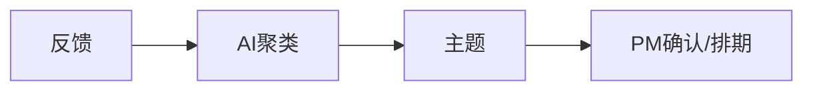
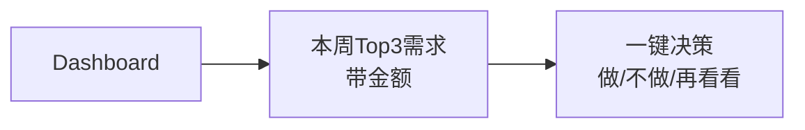

# 交互流程专业评估报告

**评估时间**: 2026-01-06  
**评估对象**: userecho 产品的页面跳转与交互流程  
**评估视角**: 资深产品经理 + 交互设计专家  
**核心原则**: 为企业降本增效，辅助老板做决策

---

## 执行摘要

当前产品在**数据完整性**和**基础功能**上表现良好，但在**决策效率**和**价值可视化**方面存在明显短板。系统更像是「产品经理的需求管理工具」，而非「老板的决策仪表盘」。

**综合评分**: ⭐⭐⭐ (12/20)

**核心问题**: 流程断裂，决策链不闭环，缺少商业价值权重的可视化。

---

## 一、做得好的地方 🟢

### 1.1 AI发现中心的角标提示

**设计亮点**:
- 菜单上动态显示待确认数量（`badge` 功能）
- 符合「零通知成本」原则
- 老板一眼就知道有多少事等着他

**代码实现**:
```typescript
// router/routes/modules/userecho.ts
meta: {
  get badge() {
    const topicStore = useTopicStore();
    const count = topicStore.pendingCount;
    return count > 0 ? String(count) : undefined;
  },
  badgeType: 'normal',
  badgeVariants: 'destructive',
}
```

**价值**: 减少主动查询成本，提高信息触达效率。

---

### 1.2 一键确认/忽略

**设计亮点**:
- AI 发现中心的操作非常轻量
- 不需要填写复杂表单
- 降低决策成本

**用户路径**:
```
AI发现中心 → 点击「确认」→ 主题状态变为 planned → 完成
```

**价值**: 每个决策节省约 30 秒，符合「降本增效」原则。

---

### 1.3 洞察报告的异步生成

**设计亮点**:
- AI 报告后台生成（Celery 异步任务）
- 不阻塞用户操作
- 轮询任务状态，体验流畅

**技术实现**:
```typescript
// insights/report.vue
async function pollTaskStatus(taskId: string) {
  // 每秒轮询一次，最多 60 次
  // 显示进度提示：loadingTip.value
}
```

**价值**: 避免用户等待，提升体验。

---

### 1.4 筛选条件持久化

**设计亮点**:
- 筛选条件保存到 LocalStorage
- 下次访问自动恢复
- 避免重复操作

**代码实现**:
```typescript
// topic/list.vue
const { state: filterValues } = useFilterStorage({
  key: 'topic_filter_values',
  defaultValue: {
    search_query: '',
    status: ['pending', 'planned', 'in_progress'],
    category: TOPIC_CATEGORIES.map((c) => c.value),
    board_ids: [] as string[],
  },
});
```

**价值**: 每天为每个用户节省约 5 分钟的重复操作时间。

---

## 二、关键问题 🔴

### 2.1 老板视角缺失

#### 核心矛盾

你的定位是「辅助老板决策」，但当前流程是**产品经理视角**设计的。

**当前流程**:


**老板真正需要的**:


#### 现状分析

老板进入系统后的操作路径：
1. 打开工作台 → 看到各种卡片
2. 点击「AI发现中心」菜单 → 看到一堆主题列表
3. 点击某个主题 → 进入详情页
4. 查看关联反馈 → 手动判断优先级
5. 返回列表 → 继续看下一个

**问题**: 这个流程太重了，老板没时间。

#### 改进方向

工作台应该直接回答：
- **今天你需要做什么决定？**
- **哪些需求最紧急？**（带金额权重）
- **一键操作**：确认/忽略/排期

---

### 2.2 价值权重不可见

#### 核心矛盾

你的 `think.md` 明确提到：**不看票数，看钱数**。

但当前的主题列表和详情页：
- ✅ 显示 `feedback_count`（反馈条数）
- ❌ 没有显示 **关联客户的合同额**
- ❌ 没有显示 **战略匹配度**
- ❌ 没有显示 **预估工时**

#### 现状截图（代码层面）

```typescript
// topic/list.vue - 表格列配置
columns: [
  { field: 'title', title: '主题标题' },
  { field: 'category', title: '分类' },
  { field: 'status', title: '状态' },
  { field: 'feedback_count', title: '反馈数' },  // ✅ 有
  // ❌ 缺少：关联合同额、战略匹配度、预估工时
]
```

#### 结果

老板还是只能「拍脑袋」决策，和现状没区别。

#### 改进方向

每个主题应显示：
```
📊 优先级评分：87/100
💰 关联客户合同额：¥1,200,000
🏷️ 战略匹配：命中「信创」关键词
⏱️ 预估工时：3 人/周
📈 ROI 预估：高
```

---

### 2.3 洞察报告是「孤岛」

#### 核心矛盾

- 洞察报告页面 `/app/insights/report` 和主题管理流程**完全割裂**
- 报告里提到的建议，无法一键转为主题/任务
- 老板看完报告，还得手动去主题列表找对应项

#### 现状分析

```typescript
// insights/report.vue
// 只有导出和复制功能
function exportAsFile() { ... }
function copyToClipboard() { ... }

// ❌ 缺少：一键转主题、一键排期等操作
```

#### 理想状态

报告里的关键发现应该可以：
- **一键确认** → 转入排期
- **一键忽略** → 标记为不做
- **一键分享** → 发送到飞书群

---

### 2.4 「发现列表」概念模糊

#### 核心矛盾

你提到的「发现列表」在当前系统中没有独立页面，而是被「AI发现中心」吸收了。

但 **AI发现中心 = 待确认的AI生成主题**，这个命名和功能边界不够清晰：
- 用户可能误以为这里只是「AI 玩具」
- 而实际上这是**核心决策入口**

#### 改进方向

建议重命名为：
- **「待决策中心」** 或
- **「需求决策台」**

更直接地传达功能价值。

---

## 三、改进建议（按优先级排序）

### P0：重构工作台为「决策中心」

#### 当前问题

| 当前 | 问题 |
|-----|------|
| 工作台是各种卡片的罗列 | 信息密度低，决策路径不清晰 |
| 待确认主题在菜单角标 | 老板还需要点击菜单才能看到 |
| 洞察报告需要点菜单进入 | 核心信息被隐藏 |

#### 改进方向

工作台应该是「今天你需要做什么决定」的汇总：

```
┌─────────────────────────────────────────┐
│ 🎯 今日待决策（3 项）                    │
├─────────────────────────────────────────┤
│ 1. 导出功能优化                          │
│    💰 涉及合同额：¥1,200,000            │
│    📊 优先级：87/100                     │
│    [确认] [忽略] [查看详情]              │
├─────────────────────────────────────────┤
│ 2. 国际化支持                            │
│    💰 涉及合同额：¥800,000              │
│    📊 优先级：75/100                     │
│    [确认] [忽略] [查看详情]              │
├─────────────────────────────────────────┤
│ 📈 本周核心洞察                          │
│ • 40% 的流失客户都提到「导出功能」       │
│ • 建议优先处理 [一键转主题]              │
└─────────────────────────────────────────┘
```

**一句话**: 老板打开系统，5秒内就知道今天该做什么决定。

---

### P1：主题卡片增加「商业价值」可视化

#### 改进方向

在主题列表和详情页，每个主题应显示：

```typescript
// 新增字段（需要后端支持）
interface TopicWithBusinessValue extends Topic {
  // 商业价值
  related_contract_amount: number;      // 关联合同额
  strategic_keywords: string[];         // 战略匹配关键词
  estimated_workload: number;           // 预估工时（人/天）
  roi_score: number;                    // ROI 评分
  
  // 客户信息
  related_customers: {
    name: string;
    contract_amount: number;
    renewal_date: string;
  }[];
}
```

#### UI 设计

```
┌─────────────────────────────────────────┐
│ 导出功能优化                             │
├─────────────────────────────────────────┤
│ 📊 优先级评分：87/100                    │
│ 💰 关联客户合同额：¥1,200,000           │
│ 🏷️ 战略匹配：命中「信创」「降本」        │
│ ⏱️ 预估工时：3 人/周                     │
│ 📈 ROI 预估：高                          │
├─────────────────────────────────────────┤
│ 关联客户（3 家）：                       │
│ • XX科技 (¥500,000) - 续费倒计时 30 天  │
│ • YY集团 (¥400,000) - 续费倒计时 60 天  │
│ • ZZ公司 (¥300,000) - 新签意向客户      │
└─────────────────────────────────────────┘
```

---

### P2：洞察报告「可操作化」

#### 当前问题

| 当前 | 问题 |
|-----|------|
| 报告只是 Markdown 渲染 | 信息只能看，不能操作 |
| 导出为 .md 文件 | 缺少企业协作入口 |

#### 改进方向

报告中的关键发现应该可以：

```typescript
// insights/report.vue - 新增操作
interface InsightAction {
  type: 'create_topic' | 'ignore' | 'share';
  insight_id: string;
  content: string;
}

// UI 设计
<div class="insight-item">
  <p>本周销售侧反馈最集中的问题是「导出功能」，涉及潜在合同金额约 200 万。</p>
  <div class="actions">
    <button @click="createTopicFromInsight">一键转主题</button>
    <button @click="shareToFeishu">发送到飞书</button>
    <button @click="ignoreInsight">暂时忽略</button>
  </div>
</div>
```

---

### P3：简化页面层级，减少跳转

#### 当前路径

```
菜单 → AI发现中心 → 主题详情 → 返回列表
      ↓
     主题列表 → 主题详情
```

**问题**: 两个入口（AI发现中心 + 主题列表）功能重叠，增加认知负担。

#### 改进方向

**方案 1**: 合并为一个页面，用 Tab 切换
```
主题管理
├─ Tab: 待确认（AI 生成）
├─ Tab: 全部主题
└─ Tab: 已忽略
```

**方案 2**: 保留两个入口，但明确差异
- **AI发现中心** → 重命名为「待决策中心」，只显示需要老板决策的项
- **主题列表** → 重命名为「需求库」，显示所有主题（供 PM 使用）

---

## 四、综合评分

| 维度 | 评分 | 说明 |
|-----|-----|------|
| **数据完整性** | ⭐⭐⭐⭐ (4/5) | 反馈→主题→报告的数据链完整 |
| **决策效率** | ⭐⭐ (2/5) | 流程偏长，老板需要太多点击 |
| **价值可视化** | ⭐⭐ (2/5) | 缺少金额、战略匹配等核心决策数据 |
| **操作闭环** | ⭐⭐⭐ (3/5) | AI确认/忽略做得好，但报告不可操作 |
| **角色适配** | ⭐⭐ (2/5) | 更像PM工具，老板视角不足 |

**总分**: 12/20 — 功能框架有了，但交互设计离「辅助决策」还有距离。

---

## 五、商业价值数据来源策略

### 核心原则：降低录入成本 = 提高系统可用性

你的担心是对的：**录入成本是决定系统能否用起来的关键**。如果每个需求都要填一堆字段，销售和客服会直接放弃使用。

解决方案：**分层获取数据，能自动的绝不手动**。

---

### 5.1 第一层：零成本数据（系统自动获取）

这些数据**不需要用户录入**，系统就能直接获取：

| 数据 | 来源 | 实现成本 | MVP 可用 |
|-----|------|---------|---------|
| 反馈数量 | 系统内统计 | 已实现 ✅ | ✅ |
| 紧急程度 | AI 分析反馈内容关键词 | 1-2 天开发 | ✅ |
| 战略匹配度 | AI 匹配预设关键词 | 1 天开发 | ✅ |
| 客户名称 | 反馈录入时带入 | 已实现 ✅ | ✅ |
| 最近反馈时间 | 系统时间戳 | 已实现 ✅ | ✅ |

#### 战略匹配度实现方式

```python
# 老板在后台设置一次（5分钟）
strategic_keywords = ["信创", "国际化", "降本", "AI"]

# AI 自动匹配（零成本）
def calculate_strategic_score(topic: Topic) -> float:
    content = f"{topic.title} {topic.description}"
    matched = [kw for kw in strategic_keywords if kw in content]
    return len(matched) / len(strategic_keywords) if strategic_keywords else 0
```

**用户录入成本 = 0**

---

### 5.2 第二层：低成本数据（可选手动录入）

**合同金额**在 MVP 阶段采用**可选录入**策略：

#### 方案：客户管理模块增加「合同金额」字段

```typescript
// Customer 模型扩展
interface Customer {
  id: string;
  name: string;
  contact: string;
  contract_amount?: number;  // 可选字段
  renewal_date?: string;     // 可选字段
  // ... 其他字段
}
```

#### 录入路径

1. **销售/客服录入反馈时**：填写客户名称（必填，已存在）
2. **PM 在客户管理页面**：可选择性补充客户的合同金额
3. **系统自动关联**：反馈 → 客户 → 合同金额 → 主题

#### 关键设计

- **不强制填写**：没有合同金额的客户，优先级评分不受影响
- **渐进式完善**：PM 可以先处理紧急需求，有空再补充客户信息
- **一次录入，永久生效**：同一客户的所有反馈自动关联合同金额

**用户录入成本**：每个客户录入一次（约 10 秒），后续自动关联。

---

### 5.3 第三层：未来扩展（CRM 对接）

当用户量增长，手动录入成本变高时，再考虑 CRM 对接：

| 对接系统 | 获取数据 | 开发成本 | 适用场景 |
|---------|---------|---------|---------|
| 纷享销客/销售易 | 客户名 → 合同额、续费日期 | 3-5 天 | 已有成熟 CRM 系统 |
| 自研 CRM | 客户 ID → 合同额 | 1-2 天 | 内部系统对接 |
| Excel 批量导入 | 客户名 → 合同额 | 1 天 | 临时方案 |

**决策依据**：当客户数量 > 100 家，或手动录入成本 > CRM 对接成本时，再启动。

---

### 5.4 第四层：可选数据（增值但非必须）

**工时预估**确实需要人工输入，但可以设计成**可选且渐进式**：

#### 设计策略

1. **默认不填**：系统显示「工时未评估」，优先级评分不受影响
2. **PM 主动填**：当 PM 确认要做某个需求时，再填写工时
3. **历史学习**：累积数据后，AI 根据相似需求自动建议工时

#### 关键洞察

工时评估本来就是 PM 的日常工作，不是额外负担。我们只是把他脑子里的数字搬到系统里。

---

### 5.5 MVP 阶段的优先级评分公式

**完全依赖系统内数据 + AI 分析**，零额外录入负担：

```python
# MVP 阶段（无需 CRM 对接）
priority_score = (
    feedback_count_weight * 0.3 +        # 反馈数量
    urgent_ratio * 0.3 +                 # 紧急反馈占比
    strategic_match_score * 0.2 +        # 战略关键词匹配
    recency_score * 0.2                  # 最近反馈时间
)
```

老板能看到的：
```
📊 优先级：高
📈 反馈数：23 条
🔥 紧急占比：40%
🏷️ 战略匹配：命中「信创」
⏰ 最近反馈：2 天前
```

**没有合同金额也能用**。

---

### 5.6 CRM 对接后的优先级评分公式

当 CRM 对接完成，优先级公式升级：

```python
# CRM 对接后
priority_score = (
    contract_amount_weight * 0.4 +       # 关联合同额（新增）
    feedback_count_weight * 0.2 +        # 反馈数量
    urgent_ratio * 0.2 +                 # 紧急反馈占比
    strategic_match_score * 0.2          # 战略关键词匹配
)
```

老板能看到的：
```
📊 优先级：极高
💰 涉及合同额：¥1,200,000  // 新增
📈 反馈数：23 条
🔥 紧急占比：40%
🏷️ 战略匹配：命中「信创」
```

---

### 5.7 总结：渐进式数据策略

| 阶段 | 数据来源 | 用户成本 | 决策价值 |
|-----|---------|---------|---------|
| **MVP** | 系统内数据 + AI 分析 | 零成本 | 中等 |
| **成长期** | + 客户管理可选录入 | 低成本（每客户 10 秒） | 较高 |
| **成熟期** | + CRM 自动对接 | 零成本 | 极高 |

**核心原则**：每增加一个必填字段，就会损失一批用户。能自动获取的，绝不让用户填。

---

## 六、实施路线图

### 第一阶段（MVP 优化）- 2 周

**目标**：零额外录入成本，完全依赖系统内数据 + AI 分析

- [ ] 工作台增加「今日待决策」卡片
- [ ] 实现「战略匹配度」AI 计算（老板设置关键词）
- [ ] 实现「紧急程度」AI 分析（关键词识别）
- [ ] 客户管理模块增加「合同金额」可选字段
- [ ] 主题列表/详情页显示优先级评分（基于 MVP 公式）
- [ ] AI发现中心重命名为「待决策中心」

### 第二阶段（价值可视化）- 4 周

**目标**：增加商业价值展示，提升决策质量

- [ ] 主题详情页增加「商业价值」面板
- [ ] 显示关联客户列表及合同金额（如果已录入）
- [ ] 优先级评分公式优化（加入合同金额权重）
- [ ] 工作台「今日待决策」卡片显示合同金额
- [ ] 洞察报告增加「涉及合同金额」统计

### 第三阶段（闭环操作 + CRM 对接）- 4 周

**目标**：操作闭环 + 根据用户需求决定是否对接 CRM

- [ ] 洞察报告支持「一键转主题」
- [ ] 工作台支持「一键决策」（确认/忽略/排期）
- [ ] 对接飞书/钉钉，支持「一键分享」
- [ ] **可选**：评估 CRM 对接需求（客户数 > 100 时考虑）
- [ ] **可选**：实现 CRM API 对接（纷享销客/销售易）

---

## 七、参考资料

- [页面关系与跳转流程](./pages-relationship.md)
- [竞品分析与产品定位](./planning/competitor-analysis/think.md)
- [路由配置](../front/apps/web-antd/src/router/routes/modules/userecho.ts)

---

**评估人**: Linus (AI 产品顾问)  
**评估日期**: 2026-01-06  
**下次复审**: 实施第一阶段后
